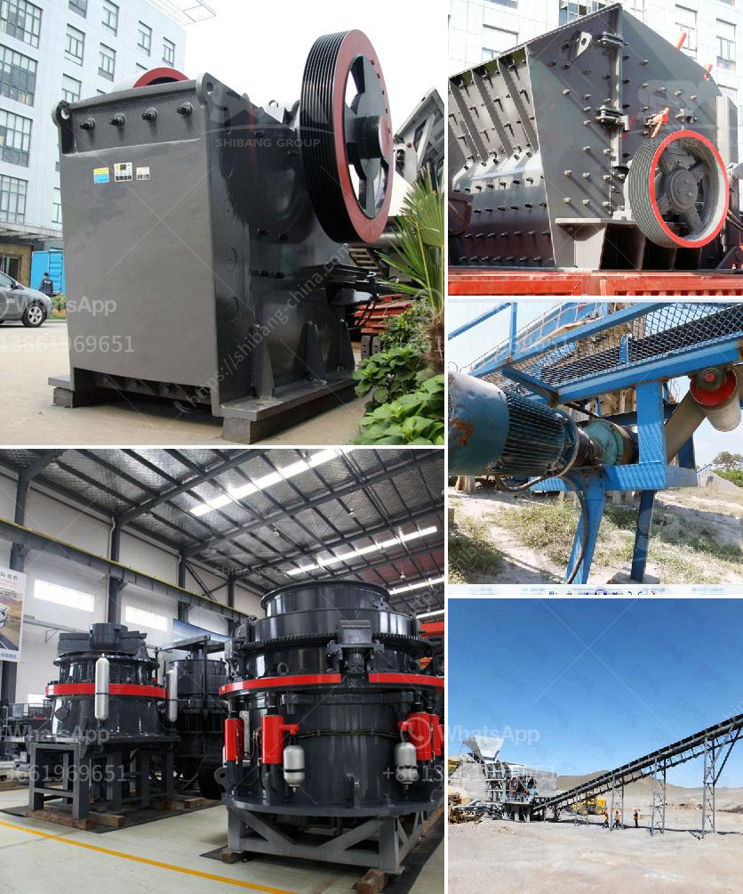

<h3>What type of crusher should I use to crush quartzite rock?</h3>
Quartzite is a beautiful natural stone that is formed when quartz-rich sandstone undergoes metamorphism. It has a high resistance to weathering and a distinct appearance that makes it a popular choice for countertops, flooring, and decorative purposes. However, when it comes to crushing quartzite rock into smaller particles for various applications, selecting the appropriate crusher is crucial. In this article, we will discuss the different types of crushers and their suitability for quartzite rock crushing.

Jaw crushers are widely used for primary crushing of hard materials, including quartzite rock. Due to their robust design and high crushing ratio, jaw crushers are an excellent choice for materials with high hardness and abrasiveness. They are capable of handling large-sized rocks and are commonly used in mining and construction industries. However, jaw crushers require regular maintenance to ensure their proper functioning and reduce the risk of breakdowns.

Cone crushers are commonly used for secondary and tertiary crushing stages. They can be an ideal choice for crushing quartzite rock, especially if the desired end product is a cubical shape. Cone crushers operate by gyrating the mantle within a concave, which causes the rock to break and become smaller. They are known for their high production capacity, efficiency, and low operating costs. Additionally, cone crushers have a long operational life if maintained properly.

Impact crushers are versatile machines that can be used for both primary and secondary crushing of quartzite rock. They work by delivering a high-speed impact force to the rock and breaking it into smaller pieces. Impact crushers are known for their higher reduction ratios, which result in a more uniform product size. They are suitable for various applications, such as concrete production, road construction, and mining. However, impact crushers may produce more fines compared to other crushers, which could affect the desired particle size distribution.

VSI crushers are suitable for crushing quartzite rock into a cubical shape, making them popular for producing high-quality aggregates. VSI crushers use a high-speed rotor and anvils for impact crushing, resulting in excellent shape and size reduction. They are efficient and offer precise control over the gradation, making them suitable for demanding applications like concrete and asphalt production. However, VSI crushers can be more expensive than other crushing equipment.

When selecting the appropriate crusher for crushing quartzite rock, several factors should be considered, including the required product size, capacity, and abrasiveness of the rock. It is also essential to evaluate the maintenance requirements, operational costs, and the availability of spare parts. Consulting with a qualified crushing equipment supplier or an experienced engineer can provide valuable guidance in choosing the most suitable crusher for your specific needs.

In conclusion, there are various types of crushers available for crushing quartzite rock, each offering unique advantages and considerations. Whether it is a jaw crusher, cone crusher, impact crusher, or VSI, the choice ultimately depends on the specific requirements and preferences of the application. By considering factors such as product size, capacity, and maintenance, you can make an informed decision to ensure efficient and effective quartzite rock crushing.
<h3>Contact us</h3><ul><li><strong>Whatsapp:&nbsp;<a href="https://wa.me/8613661969651">+8613661969651</a></strong></li><li><a href="https://swt.shibang-china.com/?git&amp;zhl&amp;What type of crusher should I use to crush quartzite rock"><strong>Online Service(chat now)</strong></a></li></ul><h3>Related</h3><ul><li><a href='How oftenwhat maintenance needs to be done on crushing plant.md'>How often/what maintenance needs to be done on crushing plant</a></li><li><a href='What tests are used to select a suitable gold ore processing plant.md'>What tests are used to select a suitable gold ore processing plant?</a></li><li><a href='What are cone crusher used to crush .md'>What are cone crusher used to crush ?</a></li><li><a href='What are the steps in manufacturing Portland cement.md'>What are the steps in manufacturing Portland cement?</a></li><li><a href='What materials can the vertical roller mill grind.md'>What materials can the vertical roller mill grind?</a></li></ul>