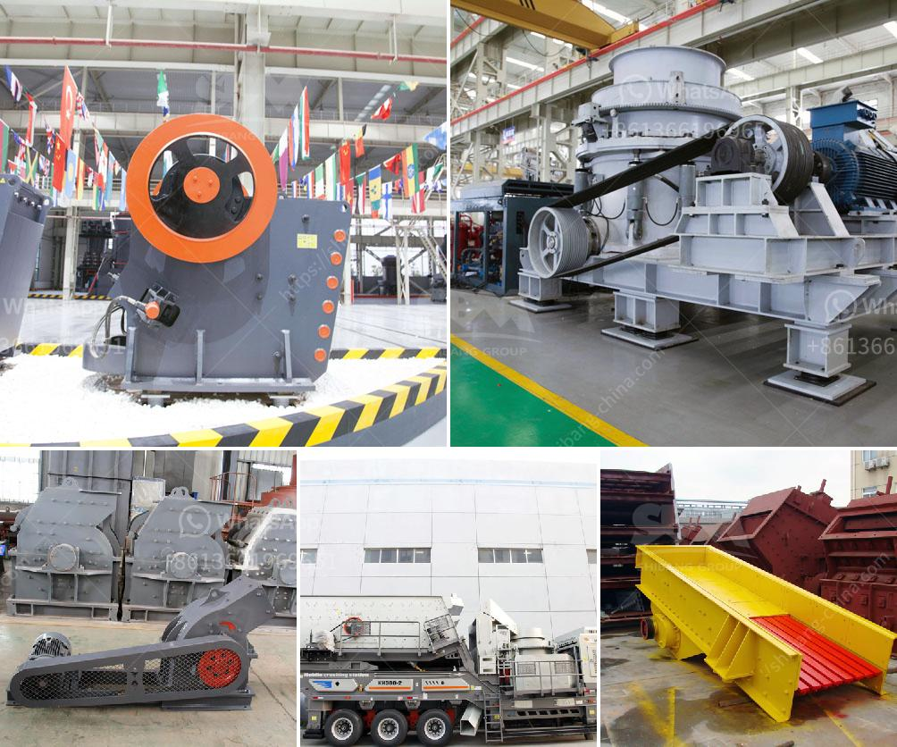

<h3>What type of crusher used for copper ore crushing?</h3>
Copper ore belongs to the brittle material. The hardness of it is between 2.5-3.5 on the Mohs scale. This means that copper ore is very easy to crush. The common copper ore crushers include the jaw crusher, cone crusher, and impact crusher. These machines have different crushing principles and performance characteristics.

Jaw crusher is used for coarse crushing. Jaw crusher is mainly used to crush various ores and bulk materials with medium particle size. It can crush materials with a compressive strength of up to 320Mpa, divided into two types: coarse crushing and fine crushing. Eastman has PE and PEX series jaw crushers with complete product specifications. Its feed size is 125mm～1020mm, and the production capacity is 1～1000T/h.

Cone crusher is used for secondary crushing. Cone crusher is a kind of crushing equipment with large crushing ratio and high production efficiency. It is suitable for fine crushing and ultra-fine crushing of hard rock, ore and other materials. Currently, there are mainly spring cone crushers and hydraulic cone crushers. These two types of cone crushers have their own advantages. However, Eastman's single-cylinder hydraulic cone crushers are also commonly used for copper ore crushing.

The single-cylinder hydraulic cone crusher of adopts the concept of the constant cavity, high-quality materials, and reasonable design and manufacture, which makes the life of the lining board the longest, thus saving a lot of cost for users. 4. Hydraulic protection and hydraulic cavity clearing, high automatization, and less stopping production and repairing time. Discharge opening is adjusted by hydraulic device and overload protection makes performance of the crusher increased by a large extent, maintenance and operation are easier, repairing time is shorter.

Impact crusher is used for secondary crushing. Impact crusher mainly relies on a certain impact force to crush materials. It uses the rotor with high speed rotation to collide with the material into the crushing chamber to crush and break the material into fine particles. In the whole crushing process, the materials are impacted three times by a hammer on the rotor rotating at a high speed. There is a grate under the rotor. The materials that do not meet the particle size requirements are continuously impacted by the rotor and crushed.

In conclusion, the above crusher types are widely used for copper ore crushing, especially the single-cylinder hydraulic cone crusher performs outstandingly in the second and third stages of crushing, breaking the ore into fine size. There are various types of crushing machines available for the crushing plant, such as jaw crusher, gyratory crusher, cone crusher, and impact crusher, etc. We also have sand making machines, which can make sand and gravel from river pebble, basalt, granite, limestone, and other ore stones. Welcome to consult us for the quotation and purchase.
<h3>Contact us</h3><ul><li><strong>Whatsapp:&nbsp;<a href="https://wa.me/8613661969651">+8613661969651</a></strong></li><li><a href="https://swt.shibang-china.com/?git&amp;zhl&amp;What type of crusher used for copper ore crushing"><strong>Online Service(chat now)</strong></a></li></ul><h3>Related</h3><ul><li><a href='What is the ore crusher discharge port size.md'>What is the ore crusher discharge port size?</a></li><li><a href='What is a belt conveyor machine .md'>What is a belt conveyor machine ?</a></li><li><a href='7 different vibrating screens how do you choose.md'>7 different vibrating screens, how do you choose?</a></li><li><a href='What are the mechanical devices used in mining What is the role of each.md'>What are the mechanical devices used in mining? What is the role of each?</a></li><li><a href='What is the best jaw crusher for coal processing.md'>What is the best jaw crusher for coal processing?</a></li></ul>