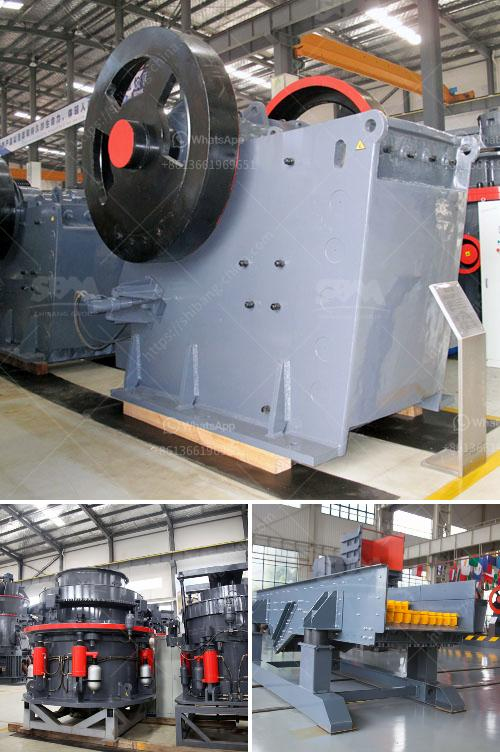

<h3>What type of flywheel is used in the double toggle jaw crusher</h3>
The flywheel is an important part of the jaw crusher. In a double toggle jaw crusher, the flywheel drives the swing jaw through its eccentric shaft. The eccentric motion of the swing jaw ensures the efficient crushing of materials.

Unlike traditional single toggle jaw crushers, the double toggle jaw crusher has two settings of the swing jaw to control the size of the crushed material. The eccentric shaft is located below the swing jaws, making it a more compact design than a single toggle jaw crusher. The swing jaws have different ways of reciprocating to efficiently crush materials.

The flywheel is a heavy-duty wheel that helps in the smooth running of the machine. It is usually made of cast iron or steel. The flywheel comprises two parts, the wheel and the flywheel pulley.

The wheel is mounted on the top of the eccentric shaft, which imparts rotational motion to the flywheel. The rotational motion of the flywheel is transferred to the swing jaws to crush the material. The large size and mass of the flywheel help in maintaining the momentum of the swing jaws, ensuring efficient crushing.

The flywheel pulley is connected to the flywheel and acts as a counterweight to balance the eccentric motion of the swing jaws. It helps in reducing the vibrations and noise generated during the crushing process and maintains the stability of the machine.

There are different types of flywheels used in double toggle jaw crushers, depending on their application and requirements. The most common types of flywheels are the conventional solid flywheel and the composite flywheel.

The conventional solid flywheel is made of a single piece of cast iron or steel and provides excellent rotational inertia. It is suitable for heavy-duty crushing applications where high inertia is required to crush the toughest materials.

The composite flywheel is made up of a combination of materials, such as cast iron or steel, and a high-strength composite material, such as carbon fiber reinforced polymer (CFRP). The composite flywheel is lighter in weight compared to the solid flywheel but provides similar rotational inertia. It offers improved energy efficiency and reduces the overall weight of the machine.

The choice of flywheel depends on various factors, such as the type of material being crushed, the required crushing capacity, and the speed of the machine. For applications requiring high inertia and heavy-duty crushing, a solid flywheel is usually preferred. For applications where weight reduction and energy efficiency are crucial, a composite flywheel is a suitable option.

In conclusion, the flywheel is an essential component of the double toggle jaw crusher. It helps in maintaining the momentum of the swing jaws, ensuring efficient crushing. The type of flywheel used depends on the application and requirements of the machine. Whether it is a conventional solid flywheel or a composite flywheel, both play a crucial role in the smooth operation of the jaw crusher.
<h3>Contact us</h3><ul><li><strong>Whatsapp:&nbsp;<a href="https://wa.me/8613661969651">+8613661969651</a></strong></li><li><a href="https://swt.shibang-china.com/?git&amp;zhl&amp;What type of flywheel is used in the double toggle jaw crusher"><strong>Online Service(chat now)</strong></a></li></ul><h3>Related</h3><ul><li><a href='what is a bench berm in mining.md'>what is a bench berm in mining?</a></li><li><a href='What is the applicability of a jaw crusher.md'>What is the applicability of a jaw crusher?</a></li><li><a href='What is Crushing and Screening .md'>What is Crushing and Screening ?</a></li><li><a href='what are the maintenance of primary ball mill？.md'>what are the maintenance of primary ball mill？</a></li><li><a href='What machinery is used to mine zinc .md'>What machinery is used to mine zinc ?</a></li></ul>