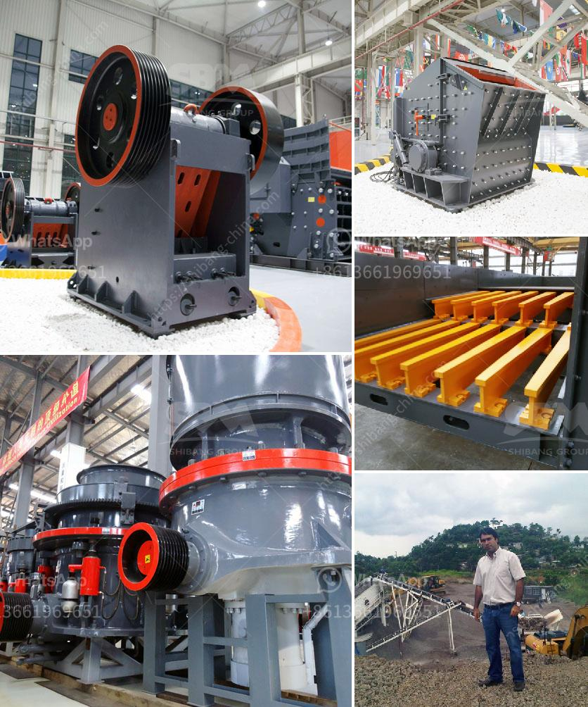

<h3>What type of jaws are in the crusher plant?</h3>
When it comes to crushing plants, there are several types of jaws commonly used, depending on the nature of the rock or material being crushed. Each type of jaw serves a specific purpose, ensuring the efficient and effective operation of the crushing plant.

One of the most commonly used jaw crusher types is the eccentric overhead jaw crusher. This is also referred to as a "Blake" crusher, named after the inventor who first introduced it in 1858. This type of jaw crusher is most commonly used in mining or aggregate industries. The eccentric overhead jaw crusher adopts a double-toggle mechanism, providing a better capacity compared to a single-toggle mechanism.

Another type of jaw crusher used in mining or aggregate industries is the swing jaw crusher. This type of crusher has a swing jaw suspended from an eccentric shaft, allowing it to move in an arc-like direction. The material is crushed when the swing jaw moves towards the fixed jaw, decreasing the gap between the two jaws.

In addition to these two types, there are other jaw crushers used in the primary crushing stage. Some jaw crushers are equipped with a hydraulic toggle mechanism, allowing the crusher to work efficiently in both directions. This helps to reduce downtime and maintenance when a piece of uncrushable material enters the crushing chamber.

Furthermore, there are also mobile jaw crusher plant models, which are specifically designed for the recycling and demolition industries. These plants are equipped with special jaws known as reversible jaws, allowing them to handle different types of materials with ease. The reversible jaws have a cutting edge on one side and a blunt edge on the other side. This allows for efficient crushing and cutting of materials, such as concrete, asphalt, and bricks.

In recent years, technological advancements have also led to the development of hybrid jaw crushers. These crushers combine the benefits of both mobile and stationary crushers, offering enhanced mobility and higher production capacity. Hybrid jaw crushers can be operated either by diesel engines or electric motors, providing flexibility in terms of power sources.

In conclusion, the type of jaws used in a crusher plant depends on the nature of the rock or material being crushed and the desired end product. From the efficient and robust eccentric overhead jaw crushers to the versatile and mobile reversible jaws, there are various options available to suit different crushing applications. With ongoing technological advancements, jaw crushers continue to evolve, offering even more efficient and effective crushing solutions for the mining and aggregate industries.
<h3>Contact us</h3><ul><li><strong>Whatsapp:&nbsp;<a href="https://wa.me/8613661969651">+8613661969651</a></strong></li><li><a href="https://swt.shibang-china.com/?git&amp;zhl&amp;What type of jaws are in the crusher plant"><strong>Online Service(chat now)</strong></a></li></ul><h3>Related</h3><ul><li><a href='What plant and equipment are required for a coal extraction project.md'>What plant and equipment are required for a coal extraction project?</a></li><li><a href='Which crusher discharges the most uniform material.md'>Which crusher discharges the most uniform material?</a></li><li><a href='What is the flywheel size and weight in a jaw crusher.md'>What is the flywheel size and weight in a jaw crusher?</a></li><li><a href='What material is generally broken by a cone crusher.md'>What material is generally broken by a cone crusher?</a></li><li><a href='What kind of crushers can I use for river rocks.md'>What kind of crushers can I use for river rocks?</a></li></ul>