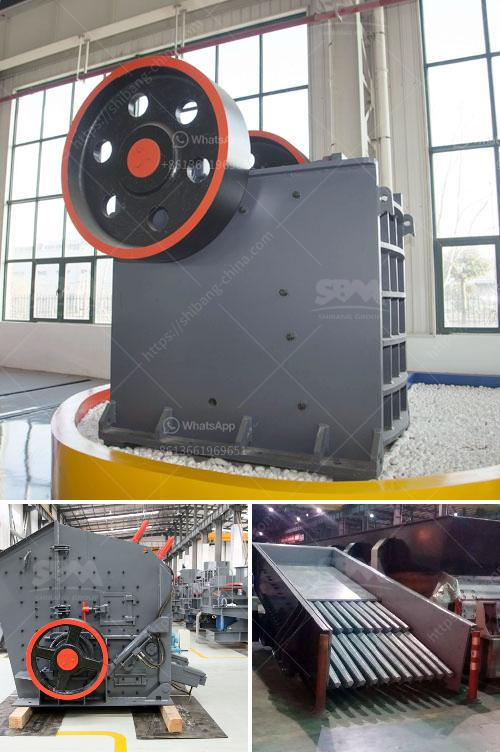

<h3>What type of machine is used in the cement industry?</h3>
The cement industry is one of the largest global industries, producing billions of tons of cement every year. To meet this enormous demand, cement manufacturers rely on a wide range of machines and equipment to produce cement efficiently, economically, and sustainably. These machines play a crucial role in every stage of the cement manufacturing process, from raw material extraction to the final product.

One of the primary machines used in the cement industry is the excavator. Excavators are used to extract limestone and other raw materials from quarries in the mining phase of cement production. These massive machines have heavy-duty buckets and strong hydraulics, enabling them to dig deep into the earth and remove tons of material in a single scoop.

After the raw materials are extracted, they need to be crushed and ground into a fine powder. This is where crushers and cement mills come into play. Crushers, known as primary crushers, break down the raw materials into smaller sizes, often around 6 inches in diameter. They can be either jaw crushers, impact crushers, or hammer crushers, depending on the type of material being processed. Once the raw materials are crushed, they are sent to cement mills, where they are further ground into a powder-like consistency.

The heart of the cement manufacturing process is the kiln. Kilns are large cylindrical furnaces where raw materials are heated at extremely high temperatures to create clinker. Clinker is a crucial intermediate product in cement production that forms when raw materials react at high temperatures. Rotary kilns are the most commonly used type of kiln in the cement industry. They consist of a long, rotating cylinder lined with firebrick. The raw materials are fed into one end of the kiln and slowly move to the other end, where they come out as hard, marble-sized pellets called clinker.

After the clinker is produced, it needs to be cooled rapidly to maintain its quality. Cooling equipment, such as the grate cooler, is used in this stage. The clinker passes through a grate system, where it is cooled by air. The grate cooler's design allows for an efficient and controlled cooling process, ensuring that the clinker reaches the optimal temperature for subsequent stages, such as storage and grinding.

Finally, cement needs to be packaged and transported. Packing machines, such as rotary packers and bagging machines, are used to fill bags with the finished cement product. These machines have high-speed rotating arms that fill bags with cement efficiently and accurately. Transportation equipment, including trucks, ships, and railways, ensure that the cement reaches its intended destinations, such as construction sites or distribution centers, in a timely manner.

In conclusion, the cement industry relies on a variety of machines and equipment to produce cement efficiently and sustainably. From excavators and crushers to kilns and packing machines, each machine plays a crucial role in the cement manufacturing process. By continually improving and innovating these machines, cement manufacturers can increase their productivity, reduce operating costs, and minimize their environmental impact.
<h3>Contact us</h3><ul><li><strong>Whatsapp:&nbsp;<a href="https://wa.me/8613661969651">+8613661969651</a></strong></li><li><a href="https://swt.shibang-china.com/?git&amp;zhl&amp;What type of machine is used in the cement industry"><strong>Online Service(chat now)</strong></a></li></ul><h3>Related</h3><ul><li><a href='what is a primary and secondary crusher？.md'>what is a primary and secondary crusher？</a></li><li><a href='What is a ball mill and how does it function.md'>What is a ball mill and how does it function?</a></li><li><a href='What is a fixed jaw crusher plate and what are its uses.md'>What is a fixed jaw crusher plate and what are its uses?</a></li><li><a href='What is the application of a ball mill.md'>What is the application of a ball mill?</a></li><li><a href='What are the parts of a Raymond Mill.md'>What are the parts of a Raymond Mill?</a></li></ul>