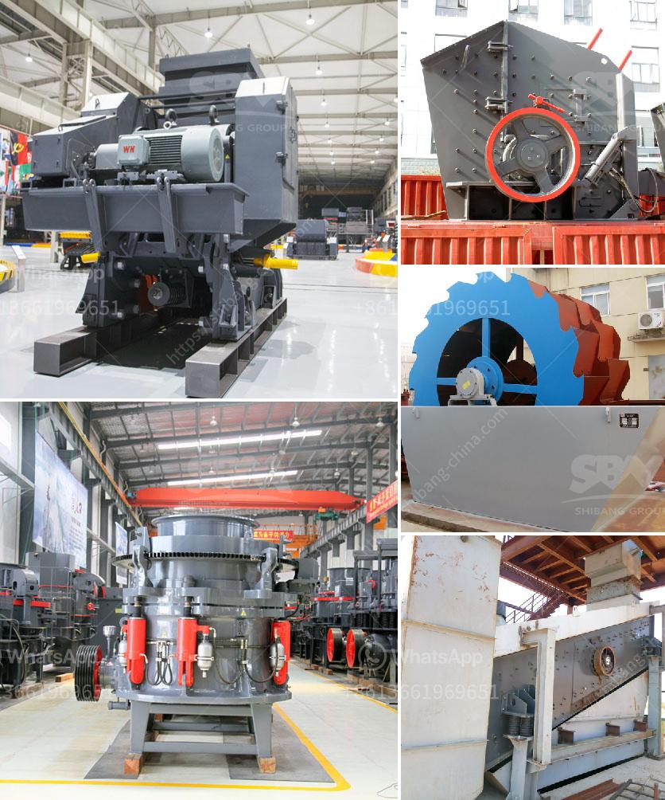

<h3>What type of motor is used in cement mills?</h3>
Cement mills are crucial in the production of materials used in construction, as they help to blend and grind clinker, gypsum, and other components into a fine powder. This powder is typically used as a binding agent in concrete, ready-mix concrete, and other construction products. 

The motor used in cement mills plays a vital role in the milling process and affects the overall efficiency and productivity of the mill. Various types of motors are used in cement mills, each having different specifications, features, and advantages. Let's explore some of the commonly used motor types in cement mills.

One of the most widely used motors in cement mills is the synchronous motor. It operates with a constant speed, making it suitable for applications requiring a fixed rotational speed. Synchronous motors offer high efficiency and power factor, reducing the energy consumption and improving the overall performance of the mill.

Also known as an induction motor, it is another popular choice for cement mills. Asynchronous motors are known for their reliability, simplicity, and ease of maintenance. They provide high starting torque, are cost-effective, and suitable for variable speed applications. However, their efficiency is relatively lower compared to synchronous motors.

This motor type is commonly used in cement mills where the load is heavy and requires high starting torque. Slip ring induction motors offer smooth acceleration, reduced inrush current, and the ability to withstand heavy loads. These motors are particularly advantageous in mills operating in harsh environments or situations with frequent power interruptions.

Although less common nowadays, DC motors were widely used in cement mills in the past. These motors offer excellent speed control, high starting torque, and their characteristic flat torque curve makes them suitable for heavy loads. However, DC motors require additional maintenance due to the presence of commutators and brushes.

It is important to note that the selection of the motor for cement mills depends on various factors, including the mill size, motor power requirements, the desired rotational speed, and the specific mill design. Factors such as the availability of power supply, the cost of the motor, and the plant's power requirements also influence the motor selection.

In conclusion, the motor used in cement mills is a critical component that significantly impacts the efficiency and productivity of the milling process. Various types of motors, including synchronous motors, asynchronous motors, slip ring induction motors, and DC motors, are used in cement mills based on their specific requirements and advantages. The selection of the motor type should be based on a careful assessment of the mill's operational needs and the desired performance.
<h3>Contact us</h3><ul><li><strong>Whatsapp:&nbsp;<a href="https://wa.me/8613661969651">+8613661969651</a></strong></li><li><a href="https://swt.shibang-china.com/?git&amp;zhl&amp;What type of motor is used in cement mills"><strong>Online Service(chat now)</strong></a></li></ul><h3>Related</h3><ul><li><a href='What is the process of mining marble.md'>What is the process of mining marble?</a></li><li><a href='What are the specifications of the copper crusher.md'>What are the specifications of the copper crusher?</a></li><li><a href='What type of quarry crusher is .md'>What type of quarry crusher is ?</a></li><li><a href='What is Crushing and Screening .md'>What is Crushing and Screening ?</a></li><li><a href='What is the best iron ore mobile crushing plant？.md'>What is the best iron ore mobile crushing plant？</a></li></ul>