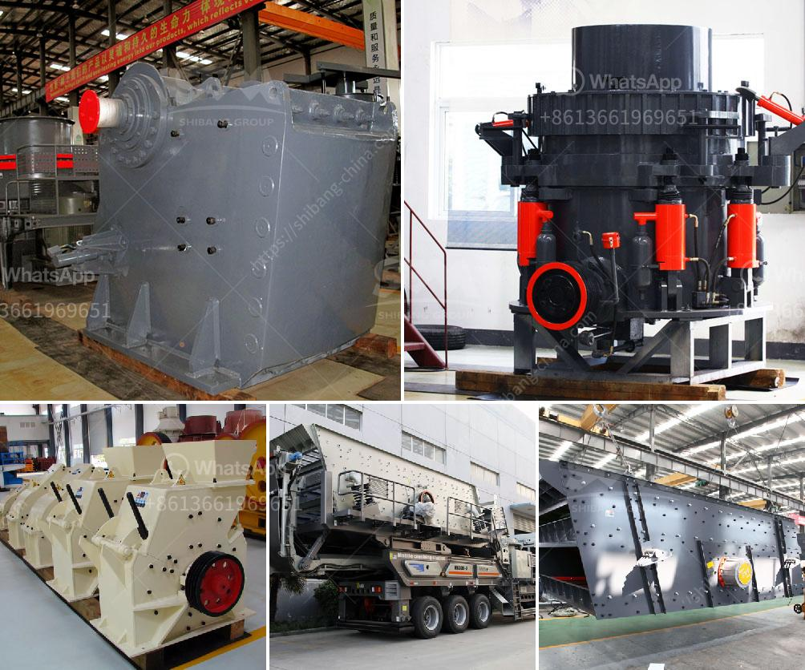

<h3>What type of quarry crusher is ?</h3>
A quarry crusher is a machine used to crush materials into smaller pieces for processing. The machinery can be stationary or portable depending on the requirements of the quarry and the desired output of the product. In a quarry, the crusher occupies a significant amount of space and plays a crucial role in the overall operation of the site. Therefore, choosing the right type of quarry crusher is essential for maximizing productivity and reducing costs.

One popular type of quarry crusher is the jaw crusher. This is a compression-style crusher that uses a series of jaws to crush materials. The material is fed into the top of the jaws, which are then brought together to crush the material into smaller pieces. Jaw crushers are known for their ability to handle hard and abrasive materials, making them ideal for quarrying applications.

Another commonly used type of quarry crusher is the impact crusher. This crusher uses a series of hammers or blow bars to strike and break the material. The crushed material is then propelled against a durable surface, such as a steel plate, to further break it down. Impact crushers are known for their high reduction ratios and ability to produce cubical-shaped end products, making them suitable for a wide range of quarrying applications.

A cone crusher is another option commonly used in quarrying operations. This crusher works by compressing the material between an eccentrically rotating cone and a concave hopper. As the cone rotates, the material is crushed and discharged through the bottom opening. Cone crushers are used for secondary and tertiary crushing, and they are particularly useful for producing finely crushed materials.

In addition to these primary crusher types, there are also specialized crushers commonly used in quarrying operations. For example, vertical shaft impact crushers (VSI) are used for crushing and shaping the aggregates used in concrete production. These crushers utilize a high-speed rotor with wear-resistant tips that imparts a crushing action on the material.

When selecting a quarry crusher, it is important to consider factors such as the hardness and abrasiveness of the material, the desired output size, and the required capacity. Additionally, the operating and maintenance costs should also be taken into account. Some crushers require regular maintenance and parts replacement, which can add to the overall operational costs.

Ultimately, the choice of quarry crusher will depend on the specific requirements of the quarry and the materials being processed. Each type of crusher has its advantages and limitations, and the most suitable option will vary depending on the unique characteristics of the quarry. Therefore, it is advisable to consult with experts and suppliers to determine the best crusher for a particular quarry operation.
<h3>Contact us</h3><ul><li><strong>Whatsapp:&nbsp;<a href="https://wa.me/8613661969651">+8613661969651</a></strong></li><li><a href="https://swt.shibang-china.com/?git&amp;zhl&amp;What type of quarry crusher is "><strong>Online Service(chat now)</strong></a></li></ul><h3>Related</h3><ul><li><a href='What equipment is used to mine tungsten stone crusher.md'>What equipment is used to mine tungsten stone crusher?</a></li><li><a href='What are the parts of a mill in a cement plant.md'>What are the parts of a mill in a cement plant?</a></li><li><a href='What type of motor is used in cement mills.md'>What type of motor is used in cement mills?</a></li><li><a href='What are the features of a jaw crusher.md'>What are the features of a jaw crusher?</a></li><li><a href='What is vsi in mobile stone jaw crusher.md'>What is vsi in mobile stone jaw crusher</a></li></ul>