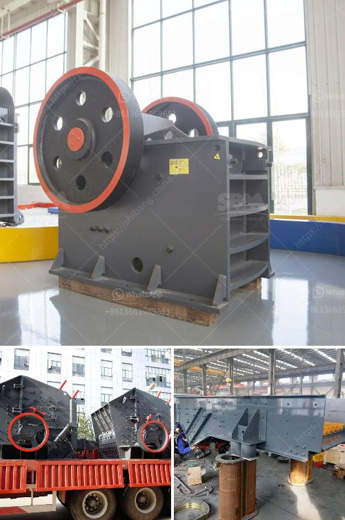

<h3>What types of crushers are used in copper mining in Zambia?</h3>
Copper mining is a significant industry in Zambia, with copper producing almost 70% of the country's exports. Copper is used in various industries, including construction, electrical engineering, transportation, and telecommunications. To extract copper from its ore, the first step is to crush the ore into smaller pieces. This article will explore the types of crushers used in copper mining in Zambia.

Jaw crushers are used as primary crushers, or the first step in the process of reducing rock. They crush primarily by using compression. The rock is dropped between two rigid pieces of metal, one of which then moves inwards towards the rock, and the rock is crushed because it has a lower breaking point than the opposing metal piece. Jaw crushers have been around for over a century, making them a conventional choice for primary crushing.

Gyratory crushers operate by means of a gyrating mantle within a surrounding bowl liner. As the mantle moves, it crushes the material against the concave walls. Gyratory crushers are exceptionally heavy-duty machines, typically used for large-scale mining operations, and they have a high level of reliability.

Cone crushers are popular rock crushing machines in aggregates production, mining operations, and recycling applications. They are normally used in secondary, tertiary, and quaternary crushing stages. However, in copper mining, cone crushers are often used as a primary crusher for larger copper ores. This versatile machine not only provides high reduction ratios but also capacity to handle high-tonnage material.

Impact crushers are versatile crushing machines that can be used in various stages of the crushing process. They are primarily used as primary crushers but can also be used as secondary or tertiary crushers. In copper mining, impact crushers are commonly used to break down secondary materials such as rock, cement, and stone during the refining process of extracting pure copper from copper ore.

Hammer crushers are used either as a one-step primary crusher or as a secondary crusher for products from a primary crusher. They are widely used for crushing hard minerals such as hard coal, limestone, gypsum, and phosphate ore. In copper mining, hammer crushers are used to crush rocks with large ores to a small size which can be further processed.

In conclusion, crushers play an essential role in the copper mining process. Various types of crushers are used to crush large-sized rocks and ores into smaller pieces suitable for further processing. Each type of crusher has its own advantages and is specialized in a specific stage of the mining process. Jaw crushers, gyratory crushers, cone crushers, impact crushers, and hammer crushers are commonly used in copper mining operations in Zambia. The choice of crusher depends on the size and hardness of the material being processed, and the desired output size.
<h3>Contact us</h3><ul><li><strong>Whatsapp:&nbsp;<a href="https://wa.me/8613661969651">+8613661969651</a></strong></li><li><a href="https://swt.shibang-china.com/?git&amp;zhl&amp;What types of crushers are used in copper mining in Zambia"><strong>Online Service(chat now)</strong></a></li></ul><h3>Related</h3><ul><li><a href='What is the largest industrial crusher.md'>What is the largest industrial crusher?</a></li><li><a href='What are the nickel smelting equipment .md'>What are the nickel smelting equipment ?</a></li><li><a href='What is the cost of artificial sand projects.md'>What is the cost of artificial sand projects?</a></li><li><a href='What is the feed of the jaw crusher .md'>What is the feed of the jaw crusher ?</a></li><li><a href='What are the specifications of the crusher for crushing concrete.md'>What are the specifications of the crusher for crushing concrete?</a></li></ul>