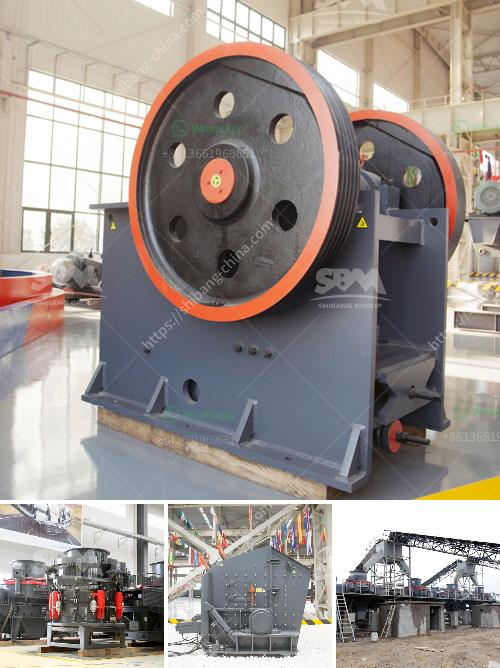

<h3>What was the magnetic ore separator used for?</h3>
The magnetic ore separator was a revolutionary machine that greatly improved ore dressing efficiency. It was designed by Edwin W. Smith, a prominent engineer and inventor in the late 19th century.

During the 1800s, mining industries began to develop rapidly across the United States. As new mines were discovered and old ones expanded, methods of extracting valuable minerals from the surrounding rocks became a crucial task. Traditional ore dressing techniques relied mainly on gravity separation, which involved shaking or rocking the ore to encourage heavy minerals to sink while lighter materials floated to the surface. While effective to some extent, these methods were time-consuming and required frequent supervision.

The magnetic ore separator was created to address the limitations of gravity separation techniques. It involved the use of a wet magnetic separator that was designed to separate ferrous and non-ferrous materials. The machine contained a spinning drum that rotated at a high speed. Inside the drum, there were a series of magnets that created a magnetic field. This field attracted and separated the magnetic particles from the non-magnetic ones, effectively concentrating the valuable minerals.

The main application of the magnetic ore separator was in the ore-dressing industry, where it was used to separate metals such as tin, tungsten, chrome, and iron from their ores. This separation process was vital for the recovery of minerals in large quantities, as it streamlined the extraction process and significantly increased productivity. 

The machine was particularly useful in extracting iron ore from low-grade deposits since it allowed for the profitable processing of previously unfeasible materials. Additionally, it enabled the production of high-quality iron concentrate, which was in high demand in the rapidly industrializing world of the late 19th century.

The magnetic ore separator played a pivotal role in the development of ore-dressing technologies and continues to find applications in various industries today. The machine remains an essential tool in narrowing down processing costs and increasing efficiency. Modern versions of the magnetic ore separator have undergone significant improvements since its inception. They are now capable of achieving highly precise separations, even in large-scale industrial settings.

In conclusion, the magnetic ore separator was a groundbreaking invention that revolutionized ore dressing methods. It offered a much-needed solution to the limitations of gravity separation techniques and enabled the extraction of valuable minerals on a larger scale. By concentrating the magnetic particles, this machine facilitated the recovery of metals such as tin, tungsten, chrome, and iron from their ores. Its impact on the mining industry was significant, making it an invaluable tool for ore-dressing operations during the late 19th century and beyond.
<h3>Contact us</h3><ul><li><strong>Whatsapp:&nbsp;<a href="https://wa.me/8613661969651">+8613661969651</a></strong></li><li><a href="https://swt.shibang-china.com/?git&amp;zhl&amp;What was the magnetic ore separator used for"><strong>Online Service(chat now)</strong></a></li></ul><h3>Related</h3><ul><li><a href='What is a beneficiation plant primary mill.md'>What is a beneficiation plant primary mill?</a></li><li><a href='what is a bench berm in mining.md'>what is a bench berm in mining?</a></li><li><a href='What is construction waste and what can we do to reuse it.md'>What is construction waste, and what can we do to reuse it?</a></li><li><a href='What is cone crusher .md'>What is cone crusher ?</a></li><li><a href='What is the process that coal goes through to become a finished product.md'>What is the process that coal goes through to become a finished product?</a></li></ul>