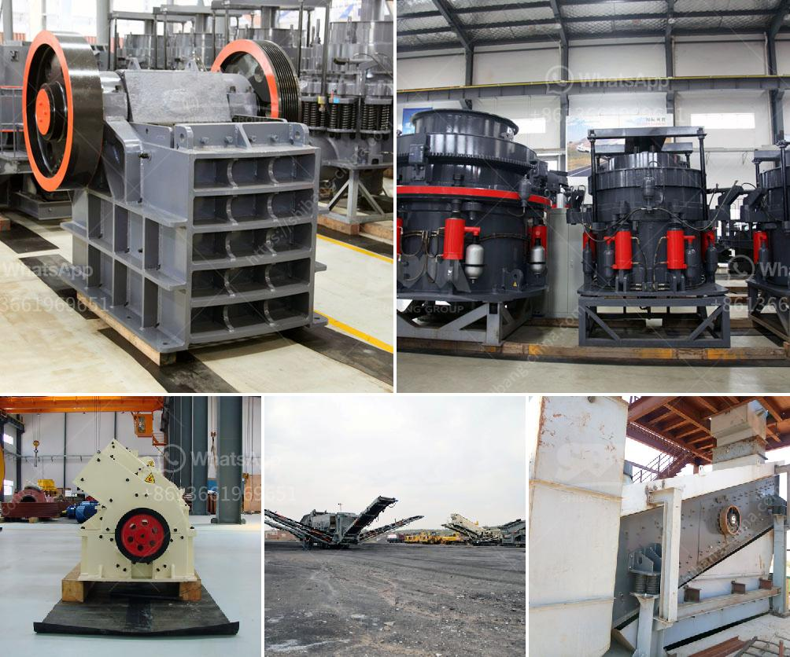

<h3>What will be the cost of a stone crusher ?</h3>
When it comes to investing in a stone crushing plant, one of the factors that you should keep in mind is the cost. While these machines vary in terms of price range, they all fall within a fairly narrow range. Some of the factors that you need to take into consideration when choosing a stone crusher machine include power usage, motor horsepower, and the overall cost to operate the machine. However, the most important factor that will determine the cost of the stone crusher is the initial cost of the machine.

The cost of a stone crusher is primarily determined by the machine’s capacity, as well as the type of stone it crushes. Most suitable stone crushers are compact, lightweight, and can be used in any capacity, making them versatile for a variety of crushing projects. This versatility is due to the fact that it acts as both a primary and secondary crusher, allowing you to choose the desired final product size. Additionally, the capacity of these machines can range from as low as 500 pounds per hour to several thousand pounds per hour.

In terms of the initial cost of the machine, you will be looking at a high investment, but you can expect to recoup that investment within a few years. This is because a stone crusher can generate a high return on investment through a decrease in operating costs and an increase in productivity. By reducing the amount of material that needs to be transported to the crusher, you will reduce your operating costs associated with fuel, labor, and equipment maintenance. At the same time, the increased productivity will enable you to process more material and generate more revenue.

The cost of a stone crusher is also affected by the increase in demand for crushed stone during construction projects. This is due to the increased need for gravel, sand, and concrete for the construction of roads, buildings, and bridges. However, the market price of a stone crusher varies depending on various factors such as the brand, model, capacity, and ingredients used to manufacture the machine. Therefore, it is important to conduct thorough market research when choosing a stone crusher to ensure that you get the best value for your money.

Furthermore, you should consider the operating and maintenance costs associated with the machine. While the initial cost of a stone crusher may be high, you need to take into account the long-term maintenance costs. This includes the cost of spare parts, repairs, and regular maintenance to keep the machine in good working order. Additionally, depending on the type of stone crusher, there may be specific requirements for the replacement of wear parts such as jaw plates and hammers.

In conclusion, the cost of a stone crusher depends on various factors such as the capacity, type, and brand of the machine, as well as the initial and long-term costs associated with its operation and maintenance. It may be a significant investment, but it can yield substantial returns in the form of increased productivity and reduced operating costs. Therefore, if you are considering investing in a stone crusher, it is essential to carefully assess your needs, conduct market research, and compare different options to make an informed decision.
<h3>Contact us</h3><ul><li><strong>Whatsapp:&nbsp;<a href="https://wa.me/8613661969651">+8613661969651</a></strong></li><li><a href="https://swt.shibang-china.com/?git&amp;zhl&amp;What will be the cost of a stone crusher "><strong>Online Service(chat now)</strong></a></li></ul><h3>Related</h3><ul><li><a href='What materials are used in concrete alternatives to sand.md'>What materials are used in concrete alternatives to sand?</a></li><li><a href='What is the process of mining orthoclase feldspar.md'>What is the process of mining orthoclase feldspar?</a></li><li><a href='What happens to the crusher when the manganese liner starts to wear out.md'>What happens to the crusher when the manganese liner starts to wear out?</a></li><li><a href='What should I know about a crusher plant.md'>What should I know about a crusher plant?</a></li><li><a href='What is the difference between a standard and shorthead cone crusher.md'>What is the difference between a standard and shorthead cone crusher?</a></li></ul>