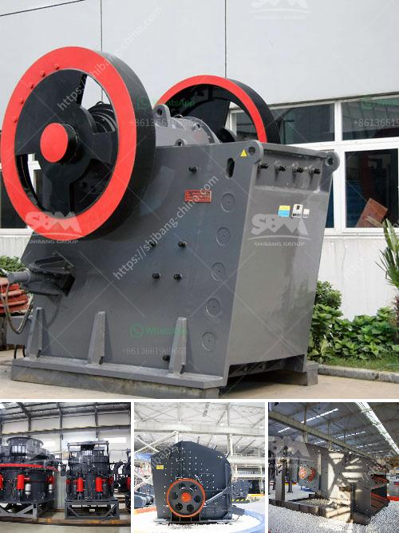

<h3>Which crusher discharges the most uniform material?</h3>
When it comes to crushing equipment, the goal is to reduce large rocks into smaller, more manageable sizes. One crucial factor to consider is how uniform the materials are when they are discharged from the crusher. A uniform material is essential for many industries, such as construction, mining, and recycling, where consistent quality is required.

Various types of crushers are available on the market, each with its unique characteristics. However, some crushers are better at producing uniform materials than others. Let's take a closer look at a few popular crushers and determine which one discharges the most uniform material.

Jaw crushers are known for their versatility and ability to handle hard, abrasive materials. They use compression to crush the material, making them ideal for primary crushing applications. While jaw crushers can produce uniform material, the size distribution may not always be optimal, especially if the feed contains a mix of different sizes. Additionally, some jaw crushers tend to generate more fines, which can result in a less uniform discharge.

Cone crushers are widely used in the mining industry for secondary and tertiary crushing stages. They are typically used after jaw crushers to produce more uniform materials. Cone crushers excel at producing cubical-shaped materials, resulting in better product quality. However, the size of the discharge depends on the closed side setting (CSS) and the type of material being crushed. It is crucial to adjust the CSS accurately to achieve the desired uniformity.

Impact crushers are versatile machines that can handle various materials, including soft and medium-hard rocks. These crushers use impact forces to break the material, resulting in a higher reduction ratio compared to other crushers. Impact crushers offer excellent control over the product size and shape, making them suitable for producing uniform materials. However, the feed size and feed gradation can influence the uniformity of the discharge, making proper feed control essential.

VSI crushers are often used in the final stage of crushing to produce high-quality cubical-shaped materials. VSI crushers use the principle of rock-on-rock or rock-on-steel crushing, where raw material is accelerated by a rotor against a stationary surface. They are known for their ability to produce consistent and uniform materials. However, like impact crushers, VSI crushers require careful control of the feed size and gradation to maintain uniformity in the discharge.

In conclusion, all the crushers mentioned above have the potential to produce uniform materials, but their ability to do so depends on various factors. Cone crushers and impact crushers generally have an advantage over jaw crushers when it comes to discharging more uniform materials. However, proper control of the feed size, gradation, and closed side settings is crucial for achieving optimal uniformity. It is recommended to consult with crushing equipment manufacturers or experts to determine the best crusher and operating parameters for specific applications and material types.
<h3>Contact us</h3><ul><li><strong>Whatsapp:&nbsp;<a href="https://wa.me/8613661969651">+8613661969651</a></strong></li><li><a href="https://swt.shibang-china.com/?git&amp;zhl&amp;Which crusher discharges the most uniform material"><strong>Online Service(chat now)</strong></a></li></ul><h3>Related</h3><ul><li><a href='What are the uses of a cone crusher to mining operations.md'>What are the uses of a cone crusher to mining operations?</a></li><li><a href='How oftenwhat maintenance needs to be done on crushing plant.md'>How often/what maintenance needs to be done on crushing plant</a></li><li><a href='What are some good ways to improve the capacity of a cement ball mill.md'>What are some good ways to improve the capacity of a cement ball mill?</a></li><li><a href='What are the different parts of a crusher in a power plant.md'>What are the different parts of a crusher in a power plant?</a></li><li><a href='what are common raw materials for artificial sand.md'>what are common raw materials for artificial sand</a></li></ul>