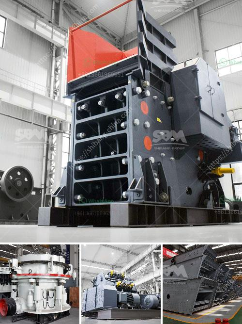

<h3>what are advantage of grinding machines？</h3>
Grinding machines are versatile tools that are used to remove excess material from various types of workpieces. These machines are commonly used in workshops and factories for shaping and finishing metal parts, and they have numerous advantages over other types of machining tools. In this article, we will explore some of the key benefits of using grinding machines.

First and foremost, grinding machines are highly accurate and precise. They can achieve high tolerances and smooth finishes on even the most intricate parts. This level of precision is essential in industries such as aerospace, automotive, and medical, where the quality and reliability of the final product are paramount. Grinding machines can be programmed to perform complex tasks with great accuracy, ensuring that the workpieces meet all required specifications.

Another advantage of grinding machines is their versatility. Unlike other machining tools, such as milling machines or lathes, grinding machines can be used for a wide range of tasks. They can perform both rough and fine grinding, remove large amounts of material or tiny chips, and create smooth or textured surfaces. This versatility makes grinding machines suitable for various industries and applications.

In addition, grinding machines are highly efficient and productive. They can remove material rapidly, significantly reducing the time required to manufacture a part. Unlike other machining methods that may require multiple passes or setup changes, grinding machines can often complete the entire process in a single operation. This efficiency translates into cost savings and increased productivity for manufacturers.

Grinding machines are also known for their ability to work with hard materials. They can easily handle materials such as hardened steel, stainless steel, and other alloys that are challenging to machine using other methods. The hardness of these materials makes them prone to excessive tool wear or damage, but grinding machines can handle them without any issues, making them ideal for industries that require machining of tough materials.

Safety is another advantage of grinding machines. Modern grinding machines are equipped with various safety features to protect the operator and prevent accidents. These include guards, emergency stop buttons, and interlocks that ensure the machine does not operate unless all safety measures are in place. Furthermore, grinding machines often produce less heat and sparks compared to other machining methods, reducing the risk of fire or explosions.

Finally, grinding machines are generally low maintenance and easy to operate. They typically require minimal setup and can be quickly adjusted for different tasks. With proper maintenance and regular servicing, grinding machines can provide many years of reliable operation, making them a cost-effective investment for manufacturers.

In conclusion, grinding machines offer numerous advantages over other machining tools. They provide high accuracy, versatility, efficiency, and the ability to work with hard materials. Additionally, they are safe to operate and require minimal maintenance. With these benefits, grinding machines continue to be an indispensable tool in the manufacturing industry.
<h3>Contact us</h3><ul><li><strong>Whatsapp:&nbsp;<a href="https://wa.me/8613661969651">+8613661969651</a></strong></li><li><a href="https://swt.shibang-china.com/?git&amp;zhl&amp;what are advantage of grinding machines？"><strong>Online Service(chat now)</strong></a></li></ul><h3>Related</h3><ul><li><a href='What type of crusher do I need for gold.md'>What type of crusher do I need for gold?</a></li><li><a href='What is needed to open a quarry .md'>What is needed to open a quarry ?</a></li><li><a href='What are the requirements for a sand crushing plant.md'>What are the requirements for a sand crushing plant?</a></li><li><a href='what brand of iron ore crusher more advanced.md'>what brand of iron ore crusher more advanced</a></li><li><a href='What is cone crusher .md'>What is cone crusher ?</a></li></ul>