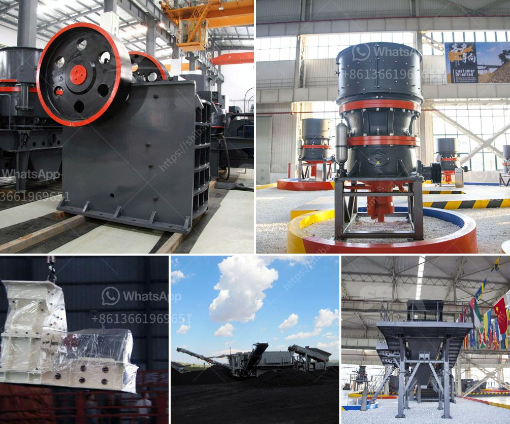

<h3>what are common raw materials for artificial sand</h3>
Artificial sand, also known as crushed sand or mechanical sand, refers to rocks, mine tailings or industrial waste granules with a particle size of less than 4.75 mm. It is processed by mechanical crushing and sieving. In China, the artificial sand was mainly used in the construction of hydropower systems. For example, the Three Gorges Project and the Yellow River Xiaolangdi Project used artificial sand to prepare concrete. Due to the remote environment of the hydropower project and the high quality of sand and gravel, the projects have taken the materials locally. Many large-scale projects in China have also begun to use artificial sand, which has promoted the rapid development of the industry.

The common raw materials for artificial sand are limestone, granite, basalt, pebbles, volcanic rock, tailings, and other materials. These materials are typically boulders or regular-shaped rocks. They are mined and processed by crushing and sieving. The raw materials used for artificial sand generally contain a certain amount of soil, which needs to be washed and cleaned before being used in construction.

Limestone is a common raw material for artificial sand. It is widely distributed and its production lines are more common. The limestone crushing process is as follows: firstly, the stone is blasted and sent to the jaw crusher for primary crushing, and then the material is fed into the sand making machine for further crushing and shaping.

Granite is also a common raw material for artificial sand. It is dense and has high compressive strength. The granite sand production line mainly includes jaw crusher, cone crusher(s), impact crusher(s), vibrating screen, sand washing machine and other equipment.

Basalt is a hard and wear-resistant rock. It is often used as the raw material for artificial sand. In the sand making process, the basalt sand production line is equipped with jaw crusher and vertical shaft impact crusher to crush the raw materials into small particles.

Pebbles are often used as the aggregate of artificial sand. The requirements for pebbles are relatively high. The raw materials need to be washed before being used for construction. Pebbles are extensively distributed and the processed materials can be used for various purposes.

Volcanic rock is porous and lightweight. It is often used as a raw material for lightweight concrete, artificial sand, and decorative stone. The volcanic rock sand production line is equipped with jaw crusher, cone crusher(s), impact crusher(s), sand making machine, vibrating screen, sand washing machine and other equipment.

Tailings are mainly composed of non-metallic minerals. They are the waste discharged from metal ore crushing and processing. They can be used to produce artificial sand by mixing them with cement or fly ash. The tailings sand production line usually includes jaw crusher, cone crusher(s), impact crusher(s), sand making machine, vibrating screen, sand washing machine and other equipment.

In conclusion, there are many common raw materials for artificial sand, which mainly include limestone, granite, basalt, pebbles, volcanic rock, tailings, etc. These materials can be widely used in construction, infrastructure, and other fields. The selection of raw materials should be based on the specific needs of the project, as well as the geological and environmental conditions of the production site.
<h3>Contact us</h3><ul><li><strong>Whatsapp:&nbsp;<a href="https://wa.me/8613661969651">+8613661969651</a></strong></li><li><a href="https://swt.shibang-china.com/?git&amp;zhl&amp;what are common raw materials for artificial sand"><strong>Online Service(chat now)</strong></a></li></ul><h3>Related</h3><ul><li><a href='What are the advantages of a roll crusher compared to other crushers.md'>What are the advantages of a roll crusher compared to other crushers?</a></li><li><a href='What materials can the vertical roller mill grind.md'>What materials can the vertical roller mill grind?</a></li><li><a href='What is a Raymond mill.md'>What is a Raymond mill?</a></li><li><a href='What is the best use of quarry limestone.md'>What is the best use of quarry limestone?</a></li><li><a href='What are the factors that promote the development of mining.md'>What are the factors that promote the development of mining?</a></li></ul>