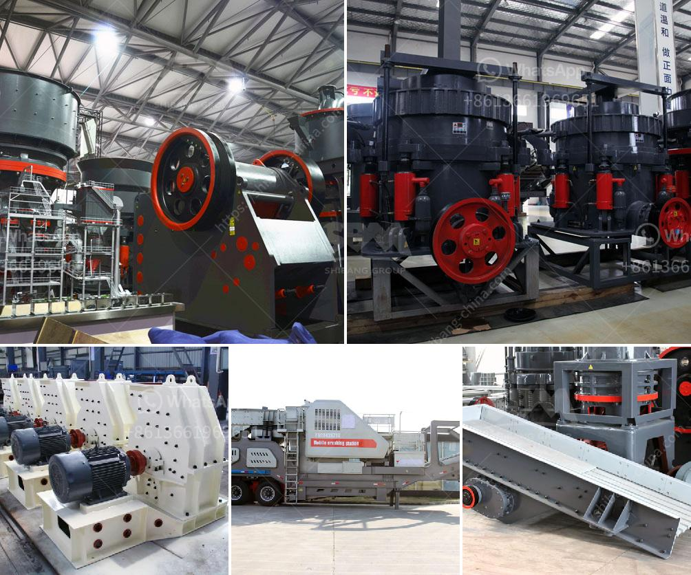

<h3>what are the by products of producing lead through mining</h3>
The mining industry plays a crucial role in supplying raw materials for various industries and supporting economic development. However, mining processes often result in the production of various by-products, some of which can have detrimental effects on the environment and public health. One such mined material that poses significant challenges in terms of its by-products is lead.

Lead has been mined and utilized for centuries due to its versatile properties, such as its corrosion resistance and malleability. It has found applications in various industries, including construction, batteries, ammunition, and electronics. However, lead mining and processing result in numerous harmful by-products that need to be carefully managed.

One of the significant by-products of lead mining is tailings, which are waste materials left after the ore has been processed to extract the desired lead content. These tailings often contain high concentrations of other heavy metals, such as cadmium, zinc, copper, and arsenic. If not properly managed, these tailings can pollute surrounding water bodies, soil, and vegetation, causing detrimental effects on ecosystem health.

In addition to tailings, lead mining and processing also generate emissions of particulate matter and sulfur dioxide (SO2). Particulate matter can contribute to air pollution and respiratory problems when inhaled by humans and animals. SO2 emissions can lead to acid rain, which is capable of damaging soil quality, vegetation, and aquatic ecosystems.

Moreover, lead itself is a toxic substance that poses severe health risks, particularly to children and pregnant women. The main health effects of lead exposure include damage to the nervous system, developmental delays in children, and increased blood pressure in adults. Consequently, it is vital to implement strict safety measures and regulations to minimize lead exposure throughout the mining process.

To address the challenges associated with lead mining by-products, several approaches can be taken. Firstly, responsible mining practices that prioritize the reduction, re-use, and recycling of waste materials can help mitigate the impact of lead mining on the environment. Sustainable waste management techniques, including filtering and treating tailings before disposal, can significantly minimize the contamination of water bodies.

Furthermore, the implementation of advanced technologies and pollution control measures can help reduce emissions of particulate matter and SO2. The mining industry should invest in technologies, such as wet scrubbers, to capture and treat pollutants before they are released into the atmosphere. Additionally, community awareness campaigns and educational programs should be implemented to promote safe handling and disposal of lead-containing products.

International regulations and guidelines are also essential in managing the by-products of lead mining. Governments and regulatory bodies should enforce strict standards for mining operations, ensuring that all environmental and health risks associated with lead mining are adequately addressed. Collaboration between mining companies, governments, and environmental organizations is vital to establish effective guidelines that safeguard both the environment and public health.

In conclusion, lead mining and processing result in various harmful by-products that can negatively impact the environment and human health. Proper waste management, the implementation of advanced technologies, and stringent regulations are crucial in mitigating the environmental and health risks associated with lead mining. By adopting sustainable practices and investing in pollution control measures, the mining industry can minimize the negative impacts of lead mining and move towards a more environmentally friendly and responsible approach to resource extraction.
<h3>Contact us</h3><ul><li><strong>Whatsapp:&nbsp;<a href="https://wa.me/8613661969651">+8613661969651</a></strong></li><li><a href="https://swt.shibang-china.com/?git&amp;zhl&amp;what are the by products of producing lead through mining"><strong>Online Service(chat now)</strong></a></li></ul><h3>Related</h3><ul><li><a href='What is the density of crushed stone aggregate 10mm 20mm and 40mm.md'>What is the density of crushed stone aggregate 10mm, 20mm, and 40mm?</a></li><li><a href='What is the difference between a ball mill and a roller mill.md'>What is the difference between a ball mill and a roller mill?</a></li><li><a href='What is bauxite used to make and how to extraction process.md'>What is bauxite used to make? and how to extraction process?</a></li><li><a href='What is crushed quartz stone.md'>What is crushed quartz stone?</a></li><li><a href='What is the process of crushers in a cement plant.md'>What is the process of crushers in a cement plant?</a></li></ul>