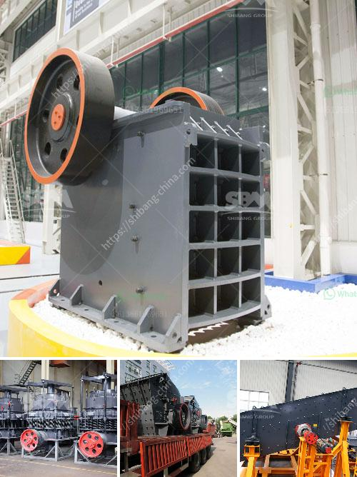

<h3>what are the equipment in iron ore crusher？</h3>
Iron ore is a crucial raw material for several industries, including construction, metallurgy, mining, and the manufacturing of automobiles. From crushing and grinding to magnetic separation and pelletizing, iron ore processing equipment has a wide range of applications.

Iron ores are rocks and minerals rich in iron oxide that can produce metallic iron by smelting. Iron ore crushing is a multi-stage process that includes primary crushing, secondary crushing, and tertiary crushing. With the increasing requirements for the fineness of iron ore, the crushers that can process iron ore with different types and fineness are different. In general, the iron ore processing line includes the primary crushing equipment, secondary crushing equipment, and tertiary crushing equipment.

The primary crusher is usually a jaw crusher or gyratory crusher that breaks down large rocks into smaller pieces. The primary crusher requires frequent maintenance due to the large amount of wear and tear that it undergoes. The size of the output material depends on the gap between the jaws or the impact plates. Commonly used primary crushers for iron ore include jaw crushers and gyratory crushers.

After the primary crushing stage, the iron ore needs to be further crushed with secondary crushing equipment. The cone crusher is often used as a secondary crusher for iron ore crushing. The efficiency of cone crushers is high with low operating cost and long service life. Secondary crusher machines may have smaller openings to produce finer material for the downstream process.

Tertiary crushers are typically used for final crushing to produce the final product of iron ore. They come in different models and configurations. The most commonly used tertiary crushers are cone crushers and impact crushers. The cone crusher crushes the iron ore by squeezing it against the walls of the chamber, while the impact crusher uses the principle of impact force to crush the material.

Apart from crushers, the iron ore beneficiation equipment also includes vibrating feeders, vibrating screens, magnetic separators, and other machines.

Vibrating Feeders: These feeders ensure a constant and controlled material flow into the crushers. They can also be used to remove unwanted materials from the ore before reaching the crushers.

Vibrating Screens: The vibrating screens separate the sized materials into different grades according to their size. The screens also help in removing unwanted oversize particles.

Magnetic Separators: Magnetic separators are used to remove ferrous materials from the iron ore. They attract and separate the magnetically susceptible materials from the non-magnetic ones.

Iron ore crushing requires various stages and different types of crushers, depending on the final product and the size of the ore. Different equipment combinations are used to process iron ore, with the primary, secondary, and tertiary crushers being the key equipment in this process. Additionally, vibrating feeders, vibrating screens, and magnetic separators play crucial roles in iron ore beneficiation. Understanding the equipment used in iron ore crushing is essential in ensuring efficient processing that ultimately leads to the production of high-quality iron ore products.
<h3>Contact us</h3><ul><li><strong>Whatsapp:&nbsp;<a href="https://wa.me/8613661969651">+8613661969651</a></strong></li><li><a href="https://swt.shibang-china.com/?git&amp;zhl&amp;what are the equipment in iron ore crusher？"><strong>Online Service(chat now)</strong></a></li></ul><h3>Related</h3><ul><li><a href='what is the quarrying process？.md'>what is the quarrying process？</a></li><li><a href='What are the coal sizing requirements for a power plant.md'>What are the coal sizing requirements for a power plant?</a></li><li><a href='What is a vertical pulverizer.md'>What is a vertical pulverizer?</a></li><li><a href='What is the cost of a jaw crusher.md'>What is the cost of a jaw crusher?</a></li><li><a href='What are the parts of a mill in a cement plant.md'>What are the parts of a mill in a cement plant?</a></li></ul>