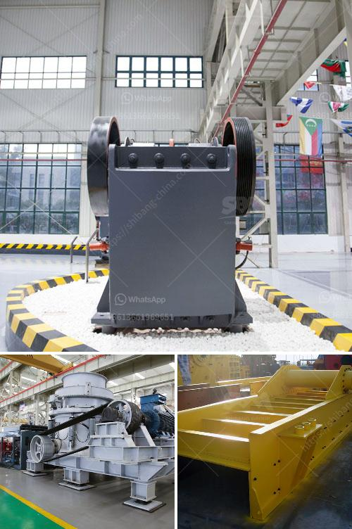

<h3>what are the maintenance of primary ball mill？</h3>
The primary ball mill is one of the most crucial pieces of equipment in the mineral processing industry. Its job is to grind large rocks into smaller pieces, making them more manageable and easier to process. Maintaining this critical equipment is of utmost importance, as failure to do so can lead to costly downtime and decreased efficiency. In this article, we will explore the maintenance practices that help ensure the smooth operation and longevity of primary ball mills.

Regular inspection is the first step in maintaining a primary ball mill. This involves visually examining the mill for any signs of wear or damage, such as cracks, corrosion, or loose components. Any issues identified during the inspection should be addressed promptly to prevent further damage and potential breakdowns.

Checking the lubrication system is another essential aspect of maintenance. The bearings and gears of a ball mill require adequate lubrication to reduce friction and heat generation. Therefore, it is crucial to monitor the lubrication system regularly, ensuring that it is properly functioning and providing sufficient lubricant to all the necessary parts.

Like any mechanical equipment, the primary ball mill also requires regular cleaning. Dust and dirt can accumulate on the machinery, causing it to operate less efficiently and potentially leading to breakdowns. Regular cleaning should involve removing any debris, dust, or residue from the mill and its components.

One of the most critical maintenance practices for a primary ball mill is monitoring the mill's performance. This involves measuring and analyzing various parameters, such as the grinding efficiency, power consumption, and particle size distribution. By monitoring these factors regularly, operators can identify any deviations from the optimal operating conditions, enabling them to take corrective actions promptly.

Additionally, maintaining an adequate spare parts inventory is essential. Ball mills contain many different components, such as liners, grinding media, and girth gears, which are subject to wear and tear. Having spare parts readily available can significantly reduce downtime in case of unexpected failures.

Lastly, it is important to have a comprehensive maintenance plan in place. This plan should outline the frequency of inspections, cleaning, lubrication, and other maintenance activities. It should also include a schedule for major maintenance tasks, such as replacing worn-out components or conducting major repairs. Adhering to this plan will help ensure that all necessary maintenance tasks are carried out timely and efficiently.

In conclusion, the maintenance of a primary ball mill is crucial for the smooth operation and longevity of the equipment. Regular inspection, checking the lubrication system, cleaning, monitoring performance, maintaining a spare parts inventory, and having a comprehensive maintenance plan all contribute to keeping the mill running efficiently. By implementing these maintenance practices, operators can minimize downtime, reduce operating costs, and extend the lifespan of their primary ball mills.
<h3>Contact us</h3><ul><li><strong>Whatsapp:&nbsp;<a href="https://wa.me/8613661969651">+8613661969651</a></strong></li><li><a href="https://swt.shibang-china.com/?git&amp;zhl&amp;what are the maintenance of primary ball mill？"><strong>Online Service(chat now)</strong></a></li></ul><h3>Related</h3><ul><li><a href='What is the process of mining galena.md'>What is the process of mining galena?</a></li><li><a href='What mill should be used for crushing rocks.md'>What mill should be used for crushing rocks?</a></li><li><a href='What good sand making equipment manufacturers are there.md'>What good sand making equipment manufacturers are there?</a></li><li><a href='What is the selling price of the hammer crusher.md'>What is the selling price of the hammer crusher?</a></li><li><a href='What do crusher model letters represent.md'>What do crusher model letters represent?</a></li></ul>