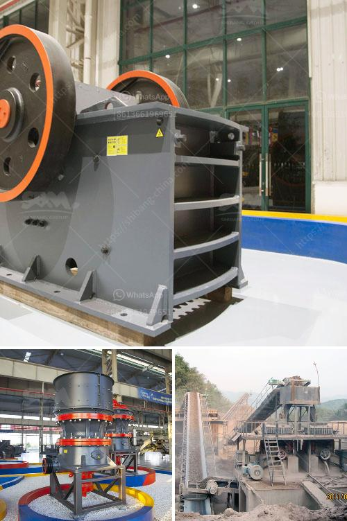

<h3>what are the raw material for cement production ?</h3>
The production of cement is a complex and energy-intensive process that requires various raw materials that serve as the foundation for this widely used construction material. Cement is a binding substance that hardens and adheres to other materials to form a solidified structure, making it crucial for the construction industry. Let's explore the primary raw materials involved in cement production.

Limestone is the most abundant raw material used in cement production. It is a sedimentary rock composed mainly of calcium carbonate. Limestone is quarried from mines and then crushed and ground into a fine powder. This powdered limestone is known as raw meal, which is used as a primary ingredient in the production of cement.

Another important raw material is clay or shale. These materials are extracted from quarries and crushed into a fine powder. Clay/shale provides the necessary silicon, aluminum, and iron oxides required for cement production. The combination of limestone and clay/shale is essential for the chemical reaction that occurs during the manufacturing process of cement.

Gypsum is a crucial additive in cement production. It is obtained either from natural sources or as a by-product from various industrial processes like coal-fired power plants or phosphoric acid production. Gypsum acts as a regulator, controlling the setting time of cement, and also improves its workability. It is typically added in small quantities, usually around 3-5% by weight of the cement.

Iron ore, alumina, and silica are also important raw materials for cement production. Iron ore, which contains iron oxide, is used as a source of iron in the manufacturing process. Alumina, an oxide of aluminum, is added to provide strength and hardness to cement. Silica, obtained from sand, is used as a source of silicon in the production of cement.

In addition to the primary raw materials mentioned above, minor additives and colorants are often used to produce specialized types of cement. These additives include fly ash, slag, pozzolana, and limestone powder. Fly ash and slag are by-products of industrial processes, such as power generation and metal smelting, and are used as supplementary cementitious materials. Pozzolanic materials, like volcanic ash or calcined clay, have cementitious properties and are added to reduce the carbon footprint of cement production. Limestone powder, obtained by grinding limestone, is used to enhance the workability and durability of cement.

It is important to note that the source and composition of raw materials can vary depending on geographical location. For instance, limestone and clay vary in quality and composition from one quarry to another. Therefore, cement manufacturers continually analyze and test their raw materials to ensure consistent quality and adapt the production process accordingly.

In conclusion, cement production involves a combination of primary raw materials like limestone and clay/shale, along with additives such as gypsum, iron ore, alumina, and silica. These raw materials undergo a series of crushing, grinding, and heating processes to form the final cement product. The composition and properties of these raw materials significantly impact the quality and characteristics of the end product, making it vital for manufacturers to carefully select and analyze their raw materials.
<h3>Contact us</h3><ul><li><strong>Whatsapp:&nbsp;<a href="https://wa.me/8613661969651">+8613661969651</a></strong></li><li><a href="https://swt.shibang-china.com/?git&amp;zhl&amp;what are the raw material for cement production "><strong>Online Service(chat now)</strong></a></li></ul><h3>Related</h3><ul><li><a href='What is the operation of a vertical roller mill.md'>What is the operation of a vertical roller mill?</a></li><li><a href='What is the common ore crusher for aluminum.md'>What is the common ore crusher for aluminum?</a></li><li><a href='what are the maintenance of primary ball mill？.md'>what are the maintenance of primary ball mill？</a></li><li><a href='What is the mining process of barite？.md'>What is the mining process of barite？</a></li><li><a href='What guards should be installed on a jaw crusher.md'>What guards should be installed on a jaw crusher?</a></li></ul>