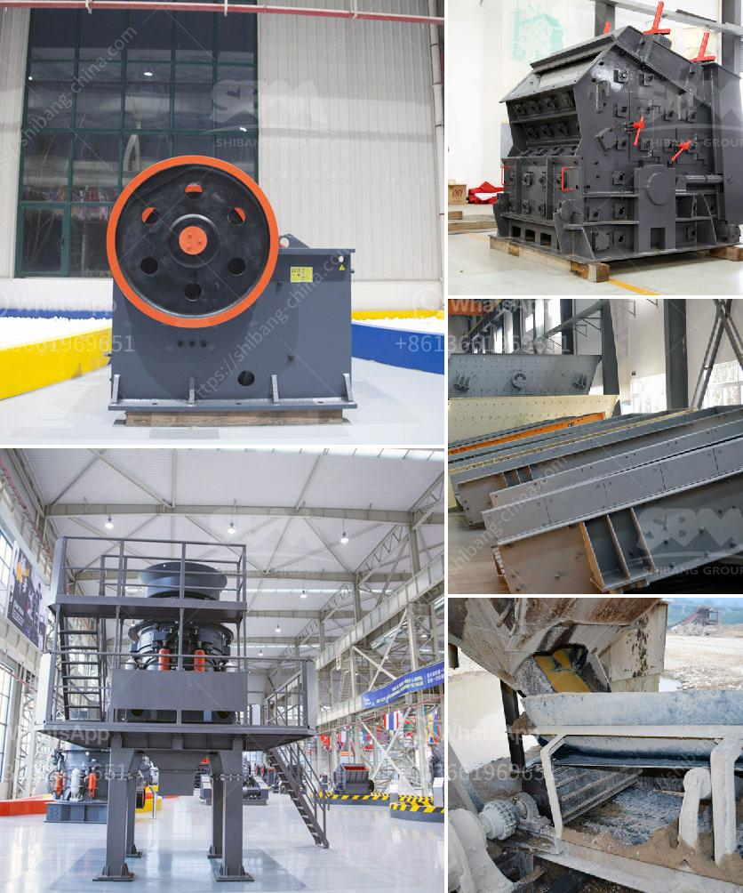

<h3>what are the steps limestone ore processed？</h3>
Limestone is a naturally occurring sedimentary rock that is primarily composed of calcium carbonate. It forms from the accumulation of shells, corals, algae, and other organic matter over millions of years. Limestone deposits can be found all across the globe and are mined for various purposes, including construction aggregates, lime production, and industrial uses.

When limestone is extracted from the earth, it is often in the form of big chunks or blocks. These large pieces need to be crushed into smaller, more manageable sizes in order to be processed further. The first step in this process is the primary crushing of the material. This is typically done using a jaw crusher or impact crusher. The limestone is reduced in size and fed into a secondary crusher, such as a cone crusher or impact crusher, where further reduction in size takes place.

After the crushing stage, the next step in the limestone processing is the screening phase. By using different screens with different sizes, the crushed limestone is sorted into different grades depending on the size of the particles. The screened limestone is then transported to different storage areas or used directly for various purposes.

The next step in the limestone processing is calcination. This is the process where the limestone is heated to a temperature above 900°C to transform it into lime or quicklime. During calcination, carbon dioxide is released from the limestone, leaving behind lime as the final product. This process is essential in the production of lime, which is used in various industries such as construction, agriculture, and chemical manufacturing.

After calcination, the quicklime is cooled and then hydrated to produce hydrated lime. This involves adding water to the quicklime, which causes a chemical reaction that produces calcium hydroxide. Hydrated lime is a versatile product used in industries such as water treatment, construction, and agriculture.

Another important step in the processing of limestone ore is beneficiation. This involves improving the quality of the limestone ore by removing unwanted impurities. The process varies depending on the intended use of the beneficiated ore. If the ore is destined for cement production, a process called beneficiation is used to remove unwanted impurities such as clay and silica. This results in a purer form of limestone that is ideal for cement production.

In conclusion, the processing of limestone ore involves crushing, screening, calcination, hydration, and beneficiation. These steps are necessary to obtain high-quality limestone with various industrial uses. The processed limestone finds its way into numerous industries, including construction, agriculture, and manufacturing. Its versatility makes it a valuable resource that continues to be in high demand across the globe.
<h3>Contact us</h3><ul><li><strong>Whatsapp:&nbsp;<a href="https://wa.me/8613661969651">+8613661969651</a></strong></li><li><a href="https://swt.shibang-china.com/?git&amp;zhl&amp;what are the steps limestone ore processed？"><strong>Online Service(chat now)</strong></a></li></ul><h3>Related</h3><ul><li><a href='what is the best installation for crusher plant production and maintenance？.md'>what is the best installation for crusher plant production and maintenance？</a></li><li><a href='What is the process of mining galena.md'>What is the process of mining galena?</a></li><li><a href='What is the purpose of gypsum added at the mill when the clinker is ground .md'>What is the purpose of gypsum added at the mill when the clinker is ground ?</a></li><li><a href='What are some applications of bauxite .md'>What are some applications of bauxite ?</a></li><li><a href='What kind of crushers can I use for river rocks.md'>What kind of crushers can I use for river rocks?</a></li></ul>