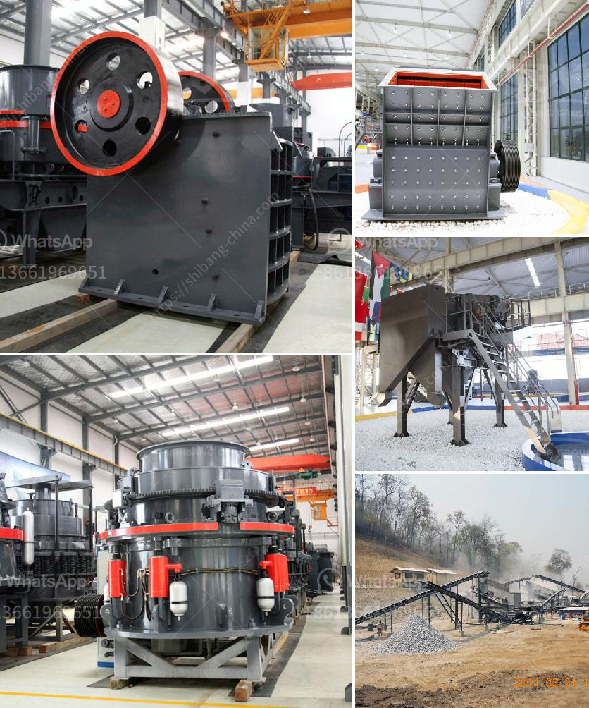

<h3>what are the various uses of lime stone powder？</h3>
Limestone powder, commonly known as lime powder or limestone dust, is a versatile and widely used material in numerous industries. Derived from limestone, a sedimentary rock formed primarily by calcium carbonate accumulation over millions of years, limestone powder is obtained through crushing, grinding, and classifying the rock into various particle sizes.

The myriad of applications for limestone powder can be found across various sectors, including construction, agriculture, chemical, and environmental. Here, we delve into some of the most prominent uses of limestone powder:

1. Construction Industry: In the construction sector, limestone powder is used as a filler and base material in the production of concrete, asphalt, and cement. It enhances the strength and durability of these materials, contributing to the construction of robust structures.

2. Agriculture: Limestone powder plays a vital role in enhancing soil quality and fertility in agriculture. Rich in calcium and magnesium, it helps neutralize acidic soils and optimize pH levels, enabling the absorption and utilization of important nutrients by plants. Additionally, due to its fine particle size, limestone powder is also beneficial in improving soil texture and providing better drainage.

3. Chemical Industry: Limestone powder finds extensive application in the chemical industry, where it is utilized as a raw material for the production of various chemicals. Lime powder is a crucial ingredient in the manufacturing of paper, rubber, paint, plastic, and even cosmetics, owing to its binding and adhesive properties.

4. Environmental Benefits: Limestone powder offers several environmental benefits. Its use in flue gas desulfurization significantly reduces air pollution, as it reacts with sulfur dioxide emissions from power plants to form calcium sulfate, a harmless byproduct. Limestone powder is also a common ingredient in wastewater treatment processes, where it aids in purifying and neutralizing water before it is released back into the environment.

5. Animal Feed: With its high calcium content, limestone powder is a valuable supplement used in animal feed production. It supports the development and maintenance of strong bones and healthy teeth in livestock, while also aiding in digestive health and improving eggshell quality in poultry.

6. Paints and Coatings: The fine particles of limestone powder make it an ideal additive in the production of paints and coatings. It enhances the consistency, stability, and adhesion of paint formulations, while also improving their weatherability and resistance to chalking.

7. Filler Material: Due to its ability to enhance the properties of various materials, limestone powder is used as a filler in the production of plastics, rubber, and adhesives. It reinforces the structure of these materials, improving their strength, durability, and overall performance.

In conclusion, limestone powder is a versatile material with numerous applications across several industries. From construction and agriculture to chemicals and environmental processes, the uses of limestone powder are expansive. Its unique properties make it an invaluable resource in enhancing the quality and performance of various materials and products, while also contributing to sustainable and eco-friendly practices.
<h3>Contact us</h3><ul><li><strong>Whatsapp:&nbsp;<a href="https://wa.me/8613661969651">+8613661969651</a></strong></li><li><a href="https://swt.shibang-china.com/?git&amp;zhl&amp;what are the various uses of lime stone powder？"><strong>Online Service(chat now)</strong></a></li></ul><h3>Related</h3><ul><li><a href='What is the difference between a wet and dry coal crusher and a hammer crusher.md'>What is the difference between a wet and dry coal crusher and a hammer crusher?</a></li><li><a href='What is the process of mining orthoclase feldspar.md'>What is the process of mining orthoclase feldspar?</a></li><li><a href='What type of crusher produces the least amount of fines.md'>What type of crusher produces the least amount of fines?</a></li><li><a href='What to people use silica sand mining for .md'>What to people use silica sand mining for ?</a></li><li><a href='What are the advantages of dry magnetic separator？.md'>What are the advantages of dry magnetic separator？</a></li></ul>