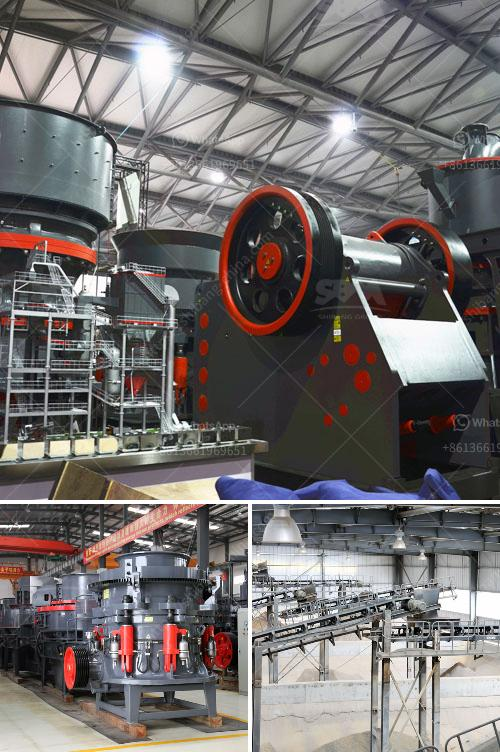

<h3>what brand of iron ore crusher more advanced</h3>
In the global mining industry, iron ore is a crucial resource that provides raw material for steel manufacturing, ensuring the sustainable growth of numerous sectors. To extract iron from its deposits, rock crushing is a critical step that prepares the ore for efficient processing. In this article, we delve into the advanced brands of iron ore crushers available in the market.

One of the most advanced brands in iron ore crushers today is Brand X. This company offers a wide range of crushers, including hammer mills, jaw crushers, and cone crushers. Their crushers consistently provide high efficiency and reliability, reducing downtime and ensuring optimal product quality. Brand X's crushers also boast advanced automation features, allowing for seamless integration into a mining operation's control systems. The ability to monitor and adjust the crusher's settings remotely further enhances operational efficiency, resulting in significant cost savings for mining companies.

Another advanced brand that stands out in the field of iron ore crushers is Brand Y. This company's crushing equipment is known for its innovative design and exceptional versatility. Brand Y's crushers can adapt to a variety of ore types, ensuring efficient processing across different mineral compositions. Furthermore, these crushers feature advanced technologies such as adjustable eccentricity and cavity profiles, improving the overall crushing performance. Brand Y also focuses on sustainability, incorporating energy-efficient designs, reducing emissions, and optimizing the crusher's overall ecological footprint.

Brand Z takes pride in its cutting-edge iron ore crushers that embody the latest technological advancements. Their crushers leverage advanced sensor technology, which provides real-time monitoring of crucial performance indicators such as temperature, vibration, and equipment health. This enables proactive maintenance, preventing costly breakdowns and minimizing downtime. Brand Z's crushers also employ state-of-the-art automation systems, optimizing the crushing process through precise control of the crushers' speed, feed rate, and discharge settings. These technologies collectively enhance productivity and ensure consistent product quality, positioning Brand Z at the forefront of crusher innovation.

As the demand for iron ore and steel continues to rise globally, the importance of efficient and reliable crushing equipment cannot be understated. With several advanced brands vying for prominence, mining companies have a wide array of options to choose from. Whether it is Brand X's efficiency, Brand Y's versatility, or Brand Z's cutting-edge technology, each brand offers distinct advantages that cater to specific operational requirements. Embracing the most advanced iron ore crushers ultimately enables mining companies to maximize productivity, reduce costs, and maintain a sustainable approach to resource extraction.
<h3>Contact us</h3><ul><li><strong>Whatsapp:&nbsp;<a href="https://wa.me/8613661969651">+8613661969651</a></strong></li><li><a href="https://swt.shibang-china.com/?git&amp;zhl&amp;what brand of iron ore crusher more advanced"><strong>Online Service(chat now)</strong></a></li></ul><h3>Related</h3><ul><li><a href='What are the different parts of a crusher in a power plant.md'>What are the different parts of a crusher in a power plant?</a></li><li><a href='What is the difference between an impact cone and jaw crusher.md'>What is the difference between an impact, cone, and jaw crusher?</a></li><li><a href='What is the process of mining orthoclase feldspar.md'>What is the process of mining orthoclase feldspar?</a></li><li><a href='What type of couplings are generally used for a gyratory crusher.md'>What type of couplings are generally used for a gyratory crusher?</a></li><li><a href='what are the steps limestone ore processed？.md'>what are the steps limestone ore processed？</a></li></ul>