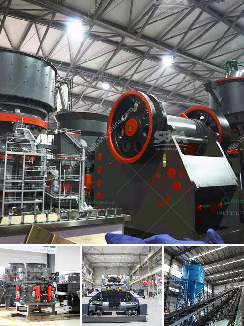

<h3>what does a raymond coal mill cost？</h3>
The Raymond coal mill of Shanghai Clirik Machinery Co., Ltd. is an environmentally friendly milling equipment widely used in various mining industries. With its unique properties and advanced technology, it has played a significant role in the production of coal mines. However, the cost of a Raymond coal mill is not a fixed value, as it varies with different manufacturers, models, and configuration options.

Firstly, the cost of a Raymond coal mill depends on the manufacturer. With the development of the mining industry, there are many manufacturers producing Raymond mills. The reputation, scale, and strength of the manufacturer will directly affect the cost. Generally, well-known manufacturers with strong strength have higher production costs, which will be reflected in the quotation of the equipment.

Secondly, the cost of a Raymond coal mill is influenced by the model. Raymond mills have different models, and the input size, output size, production capacity, and motor power will vary accordingly. Larger models generally have higher production capacity and higher costs. Customers should choose a model suitable for their own needs and production requirements to balance the cost and performance of the equipment.

Thirdly, the cost of a Raymond coal mill is also related to the configuration options. Raymond mills can be equipped with different types of equipment, including crushers, hoists, electromagnetic vibrating feeders, dust collectors, etc. The specific configuration of the equipment will directly affect the cost. Some customers may choose a more complete configuration to improve the efficiency and automation of operations, while others may choose a simpler configuration to reduce costs.

In addition, the cost of a Raymond coal mill is affected by factors such as geographical location, market competition, and raw material prices. Different regions have different production costs, and the price of equipment may vary. The level of market competition also affects the price. In areas with more manufacturers, the price may be more competitive. Changes in raw material prices, such as steel and iron, will also affect the cost of equipment.

In conclusion, the cost of a Raymond coal mill is not fixed and can vary depending on various factors. Customers should consider the reputation and strength of the manufacturer, the model and configuration options of the equipment, as well as other external factors such as geographical location and market competition when determining the cost. Consulting multiple manufacturers and comparing prices can help customers obtain a cost-effective Raymond coal mill to meet their production needs and improve efficiency.
<h3>Contact us</h3><ul><li><strong>Whatsapp:&nbsp;<a href="https://wa.me/8613661969651">+8613661969651</a></strong></li><li><a href="https://swt.shibang-china.com/?git&amp;zhl&amp;what does a raymond coal mill cost？"><strong>Online Service(chat now)</strong></a></li></ul><h3>Related</h3><ul><li><a href='What is the input and output of a crusher machine.md'>What is the input and output of a crusher machine?</a></li><li><a href='What is a stone crusher.md'>What is a stone crusher?</a></li><li><a href='What is a single toggle jaw crusher.md'>What is a single toggle jaw crusher?</a></li><li><a href='What to people use silica sand mining for .md'>What to people use silica sand mining for ?</a></li><li><a href='What type of crusher is needed to crush sillimanite？.md'>What type of crusher is needed to crush sillimanite？</a></li></ul>