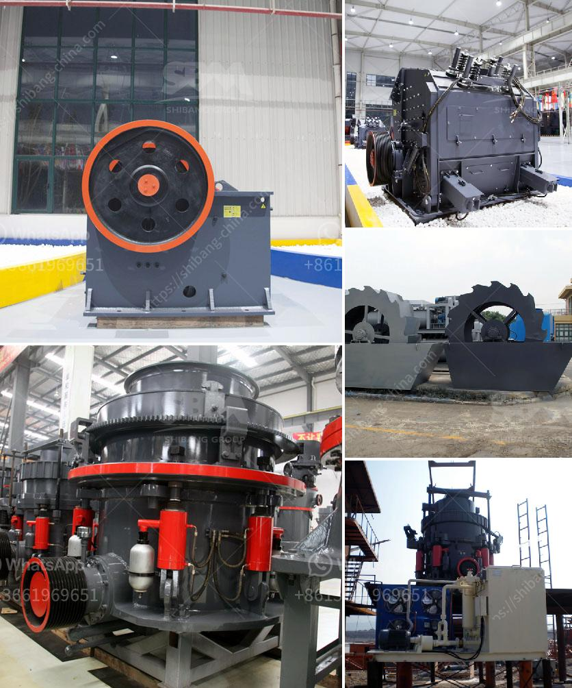

<h3>what equipment are used in the production of bentonite？</h3>
Bentonite is a versatile and widely-used industrial mineral that is predominantly used in the production of drilling fluids, pet litter, oil and gas production, construction, and environmental applications. The production of bentonite involves several key processes that require specialized equipment to ensure efficient and high-quality production. In this article, we will explore the equipment used in the production of bentonite and their role in the manufacturing process.

One of the primary processes in the production of bentonite is mining. Bentonite deposits are typically found near the surface and are extracted through open-pit mining or underground mining methods. The equipment used in these processes may include excavators, bulldozers, and haul trucks to remove the overburden and extract the bentonite ore. These machines are crucial for efficiently accessing and transporting the raw material to the processing plant.

Once the bentonite ore is extracted, it needs to be processed to remove impurities and achieve the desired properties. The first step in the processing of bentonite involves drying the extracted ore. Industrial dryers, such as rotary dryers or fluid bed dryers, are commonly used for this purpose. These dryers efficiently remove moisture from the ore, ensuring a consistent and suitable moisture content for further processing.

After drying, the bentonite undergoes milling or grinding to reduce its particle size and improve its dispersibility. Grinding mills, such as ball mills or hammer mills, are commonly used for this purpose. These mills crush, grind, and disintegrate the ore into finer particles, increasing the surface area and enhancing its reactivity.

To further enhance the properties of bentonite, it may undergo additional processes such as activation or granulation. Activation involves the treatment of bentonite with chemical additives to modify its properties, such as increasing its swelling capacity or improving its viscosity. Specialized mixers or blenders are typically used for this process, ensuring thorough and homogeneous mixing of the bentonite and additives.

Granulation, on the other hand, involves the formation of granules or pellets from the powdered bentonite. This process can enhance the handling and flowability of the material, making it easier to handle and transport. Pelletizers or granulators are commonly used for this purpose, as they can compress and shape the bentonite into uniform granules.

Finally, packaging equipment is utilized to package and distribute the finished bentonite product. Depending on the application, bentonite can be packaged in bags, bulk containers, or even directly loaded into trucks or railcars. Bagging machines, conveyors, and palletizers are commonly used in this final stage of the production process.

In conclusion, the production of bentonite involves a series of essential processes, and the equipment utilized in each stage plays a critical role in ensuring efficient production and high-quality products. From mining and drying to milling, activation, granulation, and packaging, a diverse range of equipment is utilized to handle and process the bentonite effectively. These specialized machines are essential for the production of bentonite and its widespread use in various industries.
<h3>Contact us</h3><ul><li><strong>Whatsapp:&nbsp;<a href="https://wa.me/8613661969651">+8613661969651</a></strong></li><li><a href="https://swt.shibang-china.com/?git&amp;zhl&amp;what equipment are used in the production of bentonite？"><strong>Online Service(chat now)</strong></a></li></ul><h3>Related</h3><ul><li><a href='What are the spare parts of a stone crusher.md'>What are the spare parts of a stone crusher?</a></li><li><a href='What is a fixed jaw crusher plate and what are its uses.md'>What is a fixed jaw crusher plate and what are its uses?</a></li><li><a href='What causes tension rods in jaw crushers to break.md'>What causes tension rods in jaw crushers to break?</a></li><li><a href='What is construction waste and what can we do to reuse it.md'>What is construction waste, and what can we do to reuse it?</a></li><li><a href='What is a pressurized coal mill.md'>What is a pressurized coal mill?</a></li></ul>