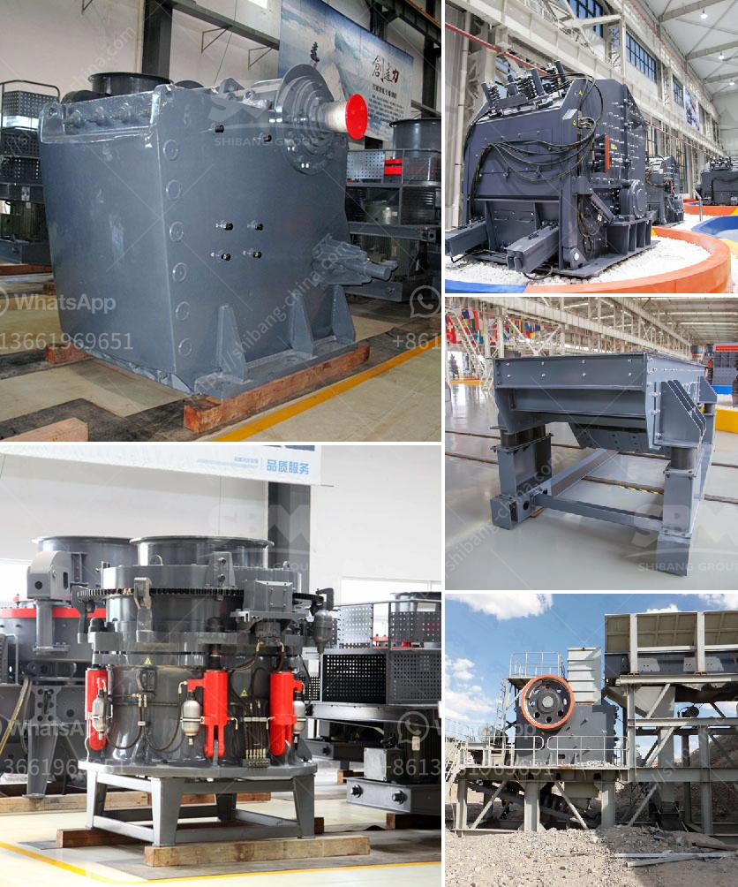

<h3>what equipments are used in the production of bentonite？</h3>
Bentonite, a clay mineral with exceptional properties, has a wide range of applications in various industries, including construction, drilling, cosmetics, and pharmaceuticals. Its unique characteristics, such as high water absorption capacity and thixotropic behavior, make it a valuable material. In order to meet the increasing demand for bentonite, efficient equipment is required for its production.

One of the key pieces of equipment used in bentonite production is a centrifugal dryer. This machine is crucial for removing excess moisture from the clay, ensuring optimal quality and enhancing its performance. The centrifugal dryer utilizes centrifugal force to rapidly spin the bentonite, expelling the water from its particles. By controlling the speed and duration of the drying process, the desired moisture content can be achieved.

To further enhance the properties of bentonite, grinding mills are used during the production process. These mills grind the bentonite into fine particles, improving its dispersion properties and increasing its surface area. This enables better interaction with other materials, enhancing the overall performance of the final product. Common grinding mills used in bentonite production include ball mills, Raymond mills, and vertical roller mills. These machines efficiently grind the bentonite to the desired fineness, ensuring optimal performance.

In addition to grinding mills, blenders are essential equipment in the production of bentonite. Blenders facilitate the mixing of different ingredients, such as additives and binders, with the bentonite clay. This process helps homogenize the mixture, ensuring uniform distribution of all components. Blenders come in various types, such as ribbon blenders, paddle blenders, and plow blenders, offering flexibility in terms of capacity and mixing efficiency.

Another crucial equipment used in bentonite production is a classifier. Classifiers help separate particles based on their size and shape, ensuring consistent particle size distribution. This is particularly important in industries where bentonite is used as a drilling fluid or as a thickening agent in construction applications. Classifiers can be either static or dynamic, with each offering different advantages and capabilities.

Moreover, storage and transportation equipment play a vital role in the overall production of bentonite. Silos and tanks are commonly used for storing the processed bentonite, protecting it from external factors that can affect its quality. Pneumatic conveyor systems are often employed to transport the bentonite from one process to another, ensuring a smooth and efficient workflow within the production facility.

In conclusion, the production of bentonite requires a range of specialized equipment to achieve the desired quality and performance. Centrifugal dryers, grinding mills, blenders, classifiers, and storage/transportation equipment are all essential components that contribute to the efficient production of bentonite. As the demand for this versatile clay mineral continues to grow, advancements in equipment technology are expected to further improve the production process, resulting in higher quality bentonite with enhanced properties.
<h3>Contact us</h3><ul><li><strong>Whatsapp:&nbsp;<a href="https://wa.me/8613661969651">+8613661969651</a></strong></li><li><a href="https://swt.shibang-china.com/?git&amp;zhl&amp;what equipments are used in the production of bentonite？"><strong>Online Service(chat now)</strong></a></li></ul><h3>Related</h3><ul><li><a href='what is the cost of stone crusher？.md'>what is the cost of stone crusher？</a></li><li><a href='What is the cost of gravel crushing .md'>What is the cost of gravel crushing ?</a></li><li><a href='What is bauxite used to make and how to extraction process.md'>What is bauxite used to make? and how to extraction process?</a></li><li><a href='What equipment is used to extract iron ore .md'>What equipment is used to extract iron ore ?</a></li><li><a href='What does it cost to mill gold ore.md'>What does it cost to mill gold ore?</a></li></ul>