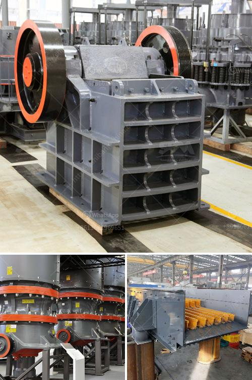

<h3>what is a bench berm in mining?</h3>
In the world of mining, numerous terms and concepts are utilized to describe various aspects of the industry. One such term that often raises eyebrows is the "bench berm." For those unfamiliar with mining terminology, understanding the meaning of this phrase can be daunting. So, let's demystify the topic and delve into what a bench berm is and its relevance in mining operations.

To comprehend the concept of a bench berm, we first need to define two key terms: "bench" and "berm." A bench refers to a horizontal level in an open-pit mine. These benches are created during the mining process when layers of material, such as soil or ore, are excavated. The excavation takes place downwards, creating a series of terraces or benches, each serving a specific purpose.

On the other hand, a berm is a flat ledge or raised barrier constructed along the edge or perimeter of a bench. These barriers or ledges are typically formed by the waste material removed during the mining process. Berms have multiple functions, including preventing loose debris from falling onto lower benches, providing access roads for vehicles, and serving as safety buffers for workers.

Now that we have defined both terms, we can clearly understand what a bench berm in mining is. It refers to the raised barrier or ledge constructed along the edges of each bench in an open-pit mine. These berms play a critical role in ensuring the safety and efficiency of mining operations.

One of the primary purposes of bench berms is to prevent material from collapsing onto lower levels. During excavation or blasting, loose debris may accumulate on the edges of benches, posing a risk to workers and equipment below. The formation of berms prevents this material from sliding, effectively stabilizing the overall structure and minimizing the likelihood of accidents.

Additionally, bench berms offer an accessible pathway for vehicles used in the mining operation. Heavy machinery, such as trucks or loaders, need a stable and even surface to navigate the mine safely. The berms act as roadways, enabling efficient movement of equipment between benches and providing stability on sloped terrains.

Furthermore, bench berms enhance safety by acting as a buffer zone. Workers can traverse the bench while staying within the confines of the berm, reducing the risk of falls or accidents. The presence of berms provides a visual and physical reminder of the boundaries and potential hazards, allowing workers to operate with heightened awareness.

It should be noted that the specific construction and dimensions of bench berms may vary based on the characteristics of the mine and local regulations. Factors such as bench height, equipment requirements, and the type of material being mined influence the design and implementation of berms.

In conclusion, a bench berm is a crucial component of mining operations, particularly in open-pit mines. These raised barriers or ledges created along the edges of benches ensure safety, stability, and accessibility. By preventing material collapse, facilitating vehicle movement, and acting as a buffer zone, bench berms contribute to the efficient and secure extraction of resources.
<h3>Contact us</h3><ul><li><strong>Whatsapp:&nbsp;<a href="https://wa.me/8613661969651">+8613661969651</a></strong></li><li><a href="https://swt.shibang-china.com/?git&amp;zhl&amp;what is a bench berm in mining"><strong>Online Service(chat now)</strong></a></li></ul><h3>Related</h3><ul><li><a href='what are the raw material for cement production .md'>what are the raw material for cement production ?</a></li><li><a href='What method of mining is used to obtain calcite.md'>What method of mining is used to obtain calcite?</a></li><li><a href='What will be the cost of a stone crusher .md'>What will be the cost of a stone crusher ?</a></li><li><a href='What is the role of a mill in a coalfired power plant.md'>What is the role of a mill in a coal-fired power plant?</a></li><li><a href='What are the specifications of the copper crusher.md'>What are the specifications of the copper crusher?</a></li></ul>