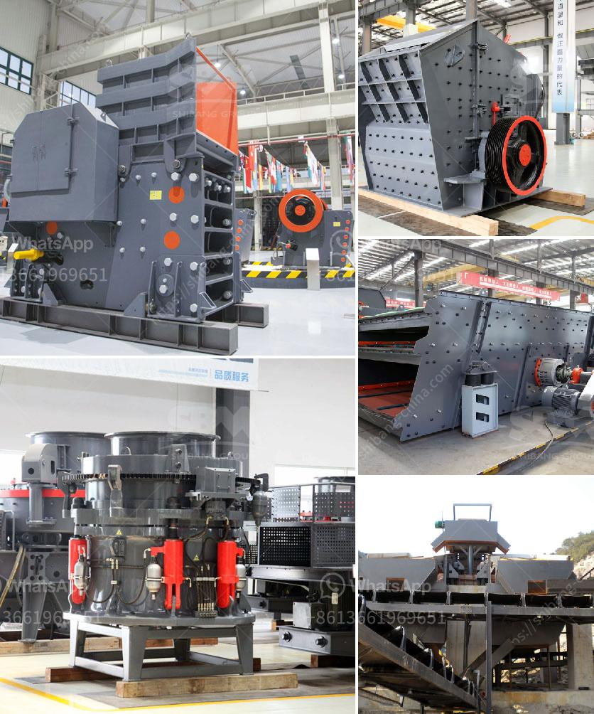

<h3>what is a mobile impactor crusher？</h3>
A mobile impactor crusher, also called a mobile impact crusher or simply a mobile crusher, is a versatile crushing machine that provides high-efficiency crushing capabilities. It is commonly used in various fields of demolition, construction, waste recycling, quarrying, and mining.

The mobile impactor crusher is a self-contained, compact equipment that is mounted on a crawler or wheeled platform. Such crushers are designed to break down various types of rocks and minerals into smaller, more manageable sizes. They can be used as stand-alone units or in combination with other equipment to form a complete crushing and screening plant.

The main advantage of a mobile impactor crusher is its flexibility. Unlike stationary crushers, a mobile impactor crusher can be easily transported to different locations or moved around a job site, reducing the need for multiple machines. This flexibility allows companies to save on transportation costs, as well as optimize their operations by targeting specific areas that require crushing.

Mobile impactor crushers are powered by diesel engines or electric motors, depending on the application and the availability of power sources. The engine or motor drives the crusher rotor, which rotates at high speed. As the rotor spins, the material is fed into the crushing chamber, where it is struck by the hammers and shattered into smaller pieces.

The crushed material then falls onto a vibrating screen, where it is separated into different sizes and further processed. This screening process ensures that only the required size of material passes through the crusher, while oversized material is returned for re-crushing.

One of the key features of a mobile impactor crusher is its high productivity and efficiency. The advanced crushing technology, combined with the mobile design, allows for quick setup and dismantling, as well as easy maintenance. Additionally, these crushers are equipped with hydraulic systems that provide safe and reliable operation, even in the toughest conditions.

Mobile impactor crushers are widely used in various industries due to their ability to produce cubic-shaped end products with excellent particle size distribution. This makes them ideal for producing aggregates for construction projects, road base materials, and even high-quality manufactured sand.

Furthermore, the mobile impactor crusher can also be used for recycling applications. It can efficiently process concrete, asphalt, and other demolition waste into reusable materials, reducing the need for fresh aggregates and contributing to a more sustainable construction industry.

In conclusion, a mobile impactor crusher is a crucial machine in the field of crushing and screening. Its versatility, efficiency, and mobility make it a valuable asset for various industries. Whether it is used for primary or secondary crushing, or for recycling applications, a mobile impactor crusher offers a reliable and cost-effective solution for processing various materials.
<h3>Contact us</h3><ul><li><strong>Whatsapp:&nbsp;<a href="https://wa.me/8613661969651">+8613661969651</a></strong></li><li><a href="https://swt.shibang-china.com/?git&amp;zhl&amp;what is a mobile impactor crusher？"><strong>Online Service(chat now)</strong></a></li></ul><h3>Related</h3><ul><li><a href='what is the cost of an 200mt capacity of cement plant？.md'>what is the cost of an 200mt capacity of cement plant？</a></li><li><a href='What is the price of barite crusher？.md'>What is the price of barite crusher？</a></li><li><a href='What are some applications of bauxite .md'>What are some applications of bauxite ?</a></li><li><a href='What are the parts of a ball mill.md'>What are the parts of a ball mill?</a></li><li><a href='What is the cost of a stone crusher plant.md'>What is the cost of a stone crusher plant?</a></li></ul>