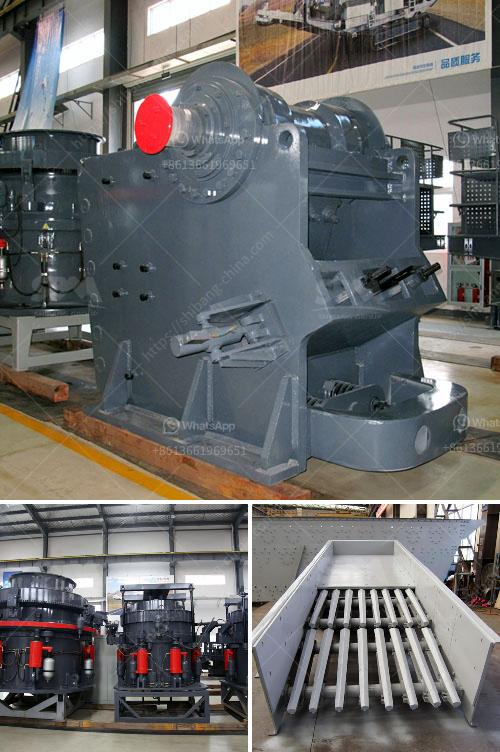

<h3>what is a primary and secondary crusher？</h3>
Crushers are important pieces of equipment in the mining and aggregate industries. They are used to break large rocks down into smaller, more manageable pieces to facilitate the extraction of valuable minerals. Primary and secondary crushers are commonly used in the mining and aggregate industries to crush blasted rock material.

In the mining industry, a crusher is a large machine that is used to break up large rocks. Depending on the type of crusher being used, the large rock will be broken into smaller rocks, gravel, or rock dust. These machines have the ability to handle large rocks, making them essential pieces of equipment in the mining industry.

Primary crushers are typically used to break up large rocks, while secondary crushers are used to break down smaller rocks or particles into finer material. The primary crusher is usually jaw or gyratory crusher, whereas the secondary crusher is usually cone or impact crusher.

Primary and secondary crushers work together to break down rock material into smaller pieces. The primary crusher reduces the size of the rock material to a manageable size, which is then taken to the secondary crusher to be broken down further. A primary crusher operates on either the compression or impact principle, while secondary crushers work based on the impact principle.

A primary crusher is designed to handle large rocks. The raw material is fed into the crusher from the top and is crushed between two surfaces – the fixed stationary surface and the moving surface. The moving surface, also known as the swing jaw, reciprocates in a horizontal direction to crush the material against the fixed stationary surface.

Secondary crushers, on the other hand, work on the principle of impact. The raw material is fed into the crusher through a hopper or a bucket and is struck by the hammers spinning at high speeds. The impact causes the material to break into smaller pieces, which are then discharged from the bottom of the crusher.

The primary and secondary crushers play a crucial role in the mining and aggregate industries. They are responsible for breaking down rock material into smaller sizes, making it easier to transport and process. Primary crushers are often used to handle larger rocks, while secondary crushers are used to break down smaller rocks or particles.

In conclusion, a primary crusher is used to break up large rocks into smaller pieces, while a secondary crusher further breaks down those smaller pieces into even finer material. Together, primary and secondary crushers are essential equipment in the mining and aggregate industries, helping to extract valuable minerals and make the material more manageable for further processing.
<h3>Contact us</h3><ul><li><strong>Whatsapp:&nbsp;<a href="https://wa.me/8613661969651">+8613661969651</a></strong></li><li><a href="https://swt.shibang-china.com/?git&amp;zhl&amp;what is a primary and secondary crusher？"><strong>Online Service(chat now)</strong></a></li></ul><h3>Related</h3><ul><li><a href='What is the disk spacing in a jaw crusher known as.md'>What is the disk spacing in a jaw crusher known as?</a></li><li><a href='what is the cost of an 200mt capacity of cement plant？.md'>what is the cost of an 200mt capacity of cement plant？</a></li><li><a href='What is the process of mining orthoclase feldspar.md'>What is the process of mining orthoclase feldspar?</a></li><li><a href='What is a jaw crusher used for.md'>What is a jaw crusher used for?</a></li><li><a href='What is a screening plant for manganese ore.md'>What is a screening plant for manganese ore?</a></li></ul>