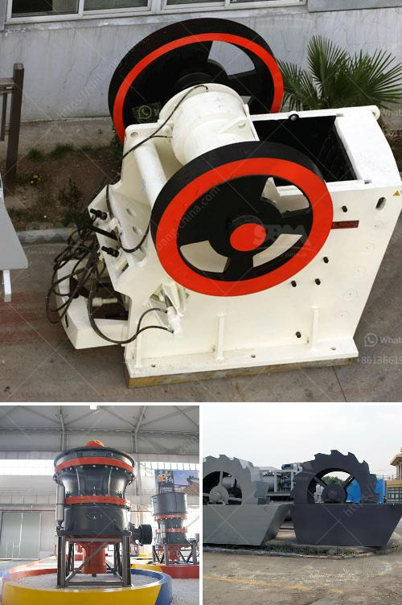

<h3>what is cost for putting up a 2500 tpd cement plant?</h3>
The construction of a cement plant is a complex and capital-intensive undertaking. Since cement plants are responsible for producing a crucial component of the construction industry, the investment required for setting up such a plant can be significant. In this article, we will explore the factors that contribute to the cost of putting up a 2500 tons per day (tpd) cement plant.

The cost of building a cement plant varies depending on several factors, including the location, the availability of resources, the scale of the project, and the latest technology involved. Let us break down these factors to shed light on the potential costs involved.

Location plays a crucial role in determining the cost of a cement plant. The cost of land, permits, licenses, and the availability of raw materials can vary significantly from one region to another. Developing countries may offer more cost-effective options due to lower land prices and abundant natural resources.

Resources, such as limestone, clay, and gypsum, are key ingredients required for cement production. Their availability in close proximity to the plant can greatly impact the cost. Transporting these resources over long distances can add significant expenses to the project.

The scale of the project also influences the cost. A 2500 tpd cement plant is considered a medium-sized plant. However, the economies of scale come into play here, as larger plants tend to be more cost-effective. The volume of production may influence the selection of machinery, as well as the cost of transportation and utilities.

Utilizing the latest technology is another factor that affects the cost. Newer technologies often come with higher upfront costs but can result in lower energy consumption and improved operational efficiency in the long run. Energy-efficient kilns and machinery require significant investment but can lead to substantial savings in energy bills and environmental benefits.

An accurate cost estimation for a 2500 tpd cement plant is difficult to provide without specific project details. However, it is safe to say that such a project can cost several hundred million dollars. Costs can vary based on the factors mentioned earlier, as well as several other considerations like labor costs, engineering costs, equipment costs, and contingency expenses.

Regardless of the specific cost figure, building a cement plant requires meticulous planning and financial resources. It is crucial to conduct a thorough feasibility study and cost analysis before commencing the project. Engaging experienced consultants and engineers can help in accurately estimating costs and ensuring a smooth execution.

In conclusion, putting up a 2500 tpd cement plant is a substantial undertaking that requires careful consideration of various factors. The location, availability of resources, scale of the project, and the use of advanced technology all contribute to the overall cost. Given the capital-intensive nature of the construction, meticulous planning and accurate cost estimation are essential for the success of such a project.
<h3>Contact us</h3><ul><li><strong>Whatsapp:&nbsp;<a href="https://wa.me/8613661969651">+8613661969651</a></strong></li><li><a href="https://swt.shibang-china.com/?git&amp;zhl&amp;what is cost for putting up a 2500 tpd cement plant"><strong>Online Service(chat now)</strong></a></li></ul><h3>Related</h3><ul><li><a href='What is the minimum possible crushing size of limestone after it has been crushed in a crusher.md'>What is the minimum possible crushing size of limestone after it has been crushed in a crusher?</a></li><li><a href='What is the total cost of a 100 TPH crusher plant.md'>What is the total cost of a 100 TPH crusher plant?</a></li><li><a href='what is the cost of an 200mt capacity of cement plant？.md'>what is the cost of an 200mt capacity of cement plant？</a></li><li><a href='What critical in stone crusher project .md'>What critical in stone crusher project ?</a></li><li><a href='What is the process of mining marble.md'>What is the process of mining marble?</a></li></ul>