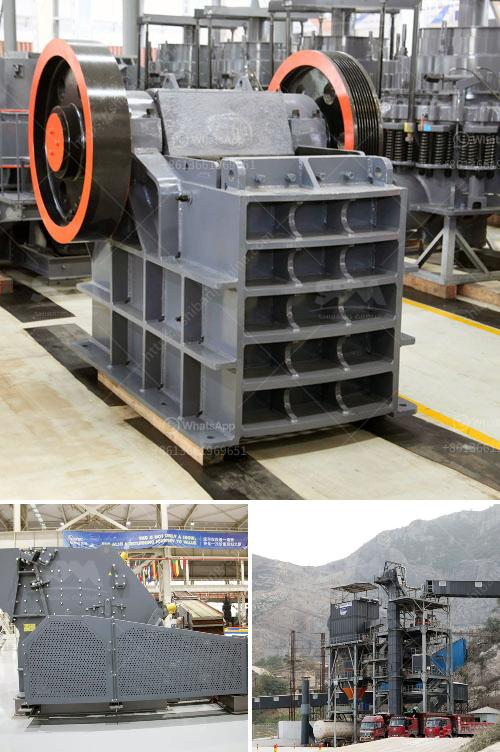

<h3>what is hammer crusher pakistan？</h3>
The construction industry in Pakistan is booming due to the rapid urbanization, extensive infrastructure development, and increasing population. This growth has necessitated the need for reliable and durable crushing equipment to ensure efficient and timely completion of projects. One such crucial machine in the construction industry is the hammer crusher.

A hammer crusher, also known as a hammer mill, is a machine designed to grind various types of material into smaller pieces. It consists of a rotating shaft fitted with hammers that crush the material by impacting it against a rotating hammer arm. This process reduces the size of the material into smaller fragments, which are then used for various construction purposes.

The use of a hammer crusher in the construction industry provides several advantages. Firstly, it helps in the recycling and reusing of various construction materials. By crushing and processing waste materials such as concrete, bricks, and asphalt, the hammer crusher allows them to be repurposed for future construction projects. This not only reduces waste but also decreases the need for raw materials, making it an environmentally friendly solution.

Secondly, the hammer crusher provides a cost-effective method for crushing and processing large quantities of material. Its robust design and high-speed operation make it capable of handling heavy-duty tasks, ensuring efficient crushing and reducing downtime. This not only saves time but also reduces the costs associated with manual labor and the procurement of raw materials.

Furthermore, the hammer crusher's versatility makes it a valuable asset in the construction industry. It can be used for various applications, including the crushing of limestone, granite, and other hard materials. Its ability to adjust the gap between the hammers and the impact plates allows for precise control of the final product size, making it suitable for different construction requirements.

In Pakistan, where the construction industry is rapidly growing, the demand for hammer crushers has increased significantly. To meet this demand, several manufacturers have emerged, providing a range of hammer crushers suitable for various construction applications. These crushers come in different sizes and configurations, allowing users to choose the most appropriate one for their specific needs.

However, it is essential to consider certain factors when choosing a hammer crusher in Pakistan. These include the machine's durability, performance, ease of maintenance, and after-sales service. Opting for a reputable manufacturer with a proven track record ensures the reliability and longevity of the machine, ultimately resulting in cost savings and improved project efficiency.

In conclusion, the hammer crusher is an indispensable machine for the construction industry in Pakistan. Its ability to crush various types of material, recycle waste materials, and provide cost-effective crushing solutions makes it a valuable asset in the construction industry. By investing in a reliable and durable hammer crusher, construction companies can enhance their operations, increase productivity, and contribute to sustainable development in Pakistan.
<h3>Contact us</h3><ul><li><strong>Whatsapp:&nbsp;<a href="https://wa.me/8613661969651">+8613661969651</a></strong></li><li><a href="https://swt.shibang-china.com/?git&amp;zhl&amp;what is hammer crusher pakistan？"><strong>Online Service(chat now)</strong></a></li></ul><h3>Related</h3><ul><li><a href='What is the best crusher for sandstone.md'>What is the best crusher for sandstone?</a></li><li><a href='What equipment is required for a large quarry.md'>What equipment is required for a large quarry?</a></li><li><a href='What is the design of the explosion proof valve for a coal mill.md'>What is the design of the explosion proof valve for a coal mill?</a></li><li><a href='What is tpd in stone crusher plant capacity.md'>What is "tpd" in stone crusher plant capacity?</a></li><li><a href='What is the difference between jaw crusher and cone crusher？.md'>What is the difference between jaw crusher and cone crusher？</a></li></ul>