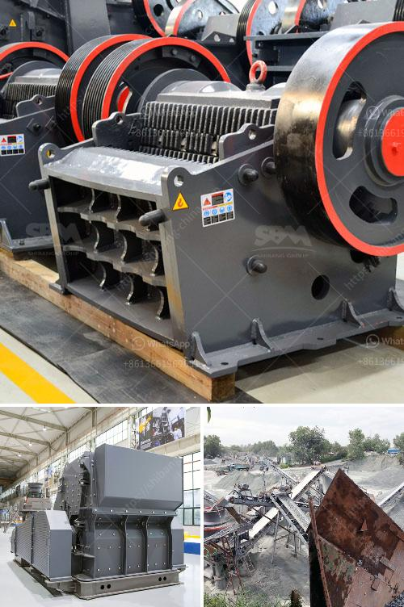

<h3>what is iron ore screening equipment？</h3>
Iron ore screening equipment is a crucial aspect of iron ore mining operations. As the name suggests, the screening process involves separating the iron ore into various sizes, which can be further processed to enhance the overall grade of the ore material. The equipment used in this process is typically advanced and highly efficient, ensuring that the desired product is obtained at the end of the screening operation.

The screening process begins with the removal of any oversize material, such as rocks, using heavy-duty machinery. This is done to ensure that the downstream processing equipment is not damaged by oversized particles. Once the oversized material has been removed, the iron ore is transported to the screening plant incorporating various crushers, classifiers, and screens. The primary crusher breaks down the large-sized raw ore material into smaller pieces suitable for further processing.

Different types of screens are used in the iron ore screening process. The most commonly used screens are static inclined or vibrating screens. These screens are ideal for large tonnages and have been extensively utilized in the iron ore industry. Their design allows them to be installed horizontally or on a slight incline, depending on the specific requirements of the operation.

The screens are equipped with different sizes of steel or rubber meshes, which help to separate the iron ore into individual fractions. The mesh size determines the final product size, and different meshes can be easily interchanged depending on the desired outcome. This flexibility is particularly helpful in iron ore screening operations, as it allows for adjustments to be made depending on market demands or changes in ore quality.

In addition to standard screens, various specialized screens are also utilized in iron ore screening plants. These include flip flow, dewatering, and scalping screens. Flip flow screens are particularly useful in situations where the screening material is moist or sticky, as they prevent clogging and ensure consistent screening performance.

Dewatering screens, as the name suggests, are used to remove excess moisture from the screened iron ore. This is essential to meet the desired moisture content for downstream processing, such as pelletizing or sintering. Scalping screens, on the other hand, are employed to remove finer-sized material before it reaches the primary crusher or other downstream equipment. This helps to minimize the amount of overgrinding, resulting in improved overall processing efficiency.

In conclusion, iron ore screening equipment is an important and necessary part of the iron ore mining process. Ensure the efficient and reliable performance of these critical equipment in the iron ore industry. Screening is essential to obtain pure and high-grade products for smelting or other downstream processes. So, understanding the various types of screening equipment and their applications can help improve the overall productivity and profitability of iron ore mining operations.
<h3>Contact us</h3><ul><li><strong>Whatsapp:&nbsp;<a href="https://wa.me/8613661969651">+8613661969651</a></strong></li><li><a href="https://swt.shibang-china.com/?git&amp;zhl&amp;what is iron ore screening equipment？"><strong>Online Service(chat now)</strong></a></li></ul><h3>Related</h3><ul><li><a href='What is the difference between jaw crusher and cone crusher？.md'>What is the difference between jaw crusher and cone crusher？</a></li><li><a href='What is the ore crusher discharge port size.md'>What is the ore crusher discharge port size?</a></li><li><a href='What is cone crusher .md'>What is cone crusher ?</a></li><li><a href='What is the difference between a standard and shorthead cone crusher.md'>What is the difference between a standard and shorthead cone crusher?</a></li><li><a href='What type of crusher should I use to crush quartzite rock.md'>What type of crusher should I use to crush quartzite rock?</a></li></ul>