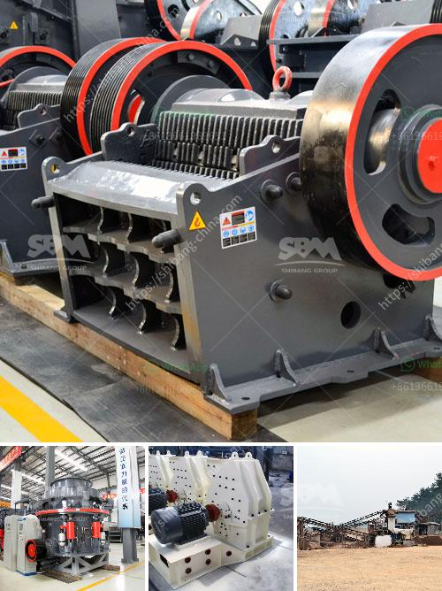

<h3>what is the best installation for crusher plant production and maintenance？</h3>
When it comes to the installation and maintenance of a crusher plant, there are several factors to consider. A well-designed and properly installed crushing plant not only ensures high production efficiency but also optimizes the lifespan of the equipment.

First and foremost, it is essential to determine the purpose and requirements of the plant. Will it be used for primary crushing or secondary crushing? What is the required capacity and output size? These factors will determine the type and size of the crusher plant needed. For example, a primary jaw crusher is suitable for a large production capacity, while a tertiary cone crusher is suitable for smaller output sizes.

Once the appropriate type and size of the crusher plant are determined, the next step is to ensure proper installation. This process involves several key aspects that should not be overlooked:

1. Site selection: The location of the crusher plant is crucial. It should be in close proximity to the source of raw materials to minimize transportation costs. Additionally, the site should have ample space for the plant, stockpiles, and other auxiliary equipment.

2. Structural design: The foundation and supporting structures of the crusher plant should be designed to withstand the dynamic loads and vibrations of the crushing process. Proper reinforcement and structural stability are crucial for the longevity of the plant.

3. Equipment selection: Choosing the right equipment for the plant is essential. It is important to consider factors such as the hardness and abrasiveness of the material to be crushed, as well as the required output size. Selecting high-quality crushers and screens that are specifically designed for the application will result in better production efficiency and reduced maintenance.

4. Electrical and plumbing installations: A crusher plant requires proper electrical and plumbing connections. It is crucial to hire professionals to ensure that the electrical wiring, power distribution, and plumbing systems are installed correctly and comply with safety regulations.

5. Regular maintenance: Once the crusher plant is installed, regular maintenance is vital to ensure its smooth operation and longevity. This includes routine inspections, lubrication, and replacing worn-out parts. Proper maintenance can significantly extend the lifespan of the equipment and minimize downtime.

In conclusion, the best installation for a crusher plant production and maintenance requires careful consideration of factors such as site selection, structural design, equipment selection, and regular maintenance. Properly installing and maintaining a crusher plant will maximize production efficiency, reduce downtime, and ensure the longevity of the equipment. Investing time and effort into the installation and maintenance process will ultimately result in cost savings and a higher return on investment.
<h3>Contact us</h3><ul><li><strong>Whatsapp:&nbsp;<a href="https://wa.me/8613661969651">+8613661969651</a></strong></li><li><a href="https://swt.shibang-china.com/?git&amp;zhl&amp;what is the best installation for crusher plant production and maintenance？"><strong>Online Service(chat now)</strong></a></li></ul><h3>Related</h3><ul><li><a href='What is the mining process of barite？.md'>What is the mining process of barite？</a></li><li><a href='What does a cone crusher do .md'>What does a cone crusher do ?</a></li><li><a href='What is the common ore crusher for aluminum.md'>What is the common ore crusher for aluminum?</a></li><li><a href='What raw materials and equipment are needed for artificial sand.md'>What raw materials and equipment are needed for artificial sand?</a></li><li><a href='What is froth flotation used for in mines.md'>What is froth flotation used for in mines?</a></li></ul>