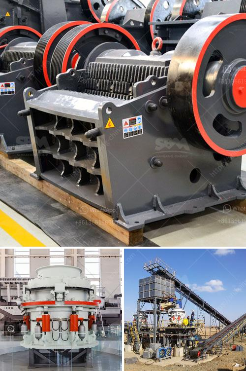

<h3>what is the cost of an 200mt capacity of cement plant？</h3>
Cement is one of the most essential building materials used in the construction industry. As a result, cement plants are vital for the production of this key ingredient. If you are interested in establishing your own cement plant, it is crucial to understand the costs involved. In this article, we will delve into the estimated cost of a 200 MT (metric ton) capacity cement plant.

Construction of a cement plant involves various expenses, ranging from land acquisition and site preparation to machinery procurement and labor costs. The cost estimation can differ based on factors like geographical location, government regulations, and market conditions. However, we can provide a general overview of the typical costs involved in setting up a 200 MT capacity cement plant.

Land acquisition and site preparation are the initial steps in establishing a cement plant. The cost of land can vary significantly depending on its location and proximity to raw material sources. In the case of a 200 MT capacity plant, it is reasonable to estimate land costs to be around $500,000-$1,000,000, considering the need for a substantial area to accommodate the plant's infrastructure and storage facilities.

Once the land is acquired, site preparation is necessary to prepare it for the construction of the cement plant. Site preparation expenses can include activities like clearing the land, leveling, and soil stabilization. Depending on the site's condition, these costs can range from $100,000 to $300,000.

The next significant cost component is the procurement of machinery. Cement plants require a range of equipment to carry out various processes, such as crushing, grinding, blending, and packaging. The estimated cost for machinery procurement in a 200 MT capacity cement plant can be around $10,000,000-$15,000,000. This estimation includes the cost of crushers, mills, kilns, conveyors, packing machines, and other necessary equipment.

Labor costs also play a significant role in the overall expenses of a cement plant. The number of workers required for a 200 MT capacity plant depends on several factors, including the level of automation and plant efficiency. To provide an approximate estimation, labor costs can range from $1,000,000 to $3,000,000 annually, catering to both skilled and unskilled workers.

Apart from the mentioned expenses, additional costs may include licensing and permits, utility connections, transportation, and ongoing maintenance. These costs can vary depending on regional regulations and specific requirements.

In conclusion, the cost of establishing a 200 MT capacity cement plant can be significant. Land acquisition and site preparation expenses, machinery procurement, and labor costs comprise the major components of this investment. However, it is important to note that the aforementioned figures are rough estimations and can vary based on numerous factors. Conducting a detailed feasibility study and consulting with industry experts would be beneficial to obtain a more accurate cost estimation for your specific project.
<h3>Contact us</h3><ul><li><strong>Whatsapp:&nbsp;<a href="https://wa.me/8613661969651">+8613661969651</a></strong></li><li><a href="https://swt.shibang-china.com/?git&amp;zhl&amp;what is the cost of an 200mt capacity of cement plant？"><strong>Online Service(chat now)</strong></a></li></ul><h3>Related</h3><ul><li><a href='What is a screening plant for manganese ore.md'>What is a screening plant for manganese ore?</a></li><li><a href='What is the bearing specification for an impact crusher.md'>What is the bearing specification for an impact crusher?</a></li><li><a href='what is a primary and secondary crusher？.md'>what is a primary and secondary crusher？</a></li><li><a href='What are the factors that promote the development of mining.md'>What are the factors that promote the development of mining?</a></li><li><a href='What happens to the crusher when the manganese liner starts to wear out.md'>What happens to the crusher when the manganese liner starts to wear out?</a></li></ul>