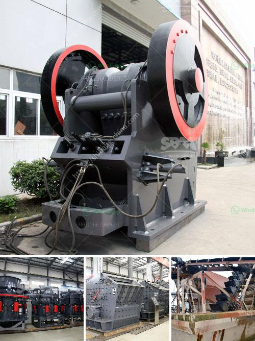

<h3>what is the cost of making gravel crusher plant 600tph？</h3>
Building a gravel crusher plant is a complex task that involves a lot of planning, budgeting, and execution. To make it cost-effective, a proper estimation of the project cost is needed. This article discusses the cost of making a gravel crusher plant 600tph, including factors that influence the overall cost.

1. Production Capacity: The plant's production capacity plays a crucial role in determining the cost. A 600tph gravel crusher plant indicates that it can handle 600 tons of material per hour. Higher production capacity generally means a more significant investment in machinery, labor, and infrastructure.

2. Equipment Selection: Choosing the right equipment is critical to ensure efficient and cost-effective operations. A gravel crusher plant typically consists of primary, secondary, and tertiary crushers, screens, conveyors, and other auxiliary equipment. The cost of each equipment component varies based on its functionality, capacity, and brand.

3. Site Location: The location of the plant also impacts the cost. Factors such as land prices, transportation costs, availability of utilities, and environmental considerations affect the overall expenditure. Building a plant in a remote area may require additional infrastructure development, resulting in higher costs.

4. Labor Costs: Skilled labor is essential for operating and maintaining a gravel crusher plant. The number of personnel required will depend on the plant's size and production capacity. Labor costs can vary based on regional wages, availability of skilled workers, and labor regulations.

5. Infrastructure Development: Developing the necessary infrastructure to support the plant incurs significant expenses. This includes constructing access roads, installing electricity and water supply systems, and setting up waste management facilities. The cost of infrastructure can vary based on the site location and its existing amenities.

6. Regulatory Compliance: Complying with environmental and safety regulations is crucial in the operation of a gravel crusher plant. The cost of obtaining permits, conducting environmental impact assessments, and implementing safety measures should be factored into the overall cost estimation.

7. Maintenance and Repairs: Regular maintenance and timely repairs are essential for the smooth running of the plant. These expenses, which include spare parts, labor, and equipment downtime, should be accounted for to calculate the total cost.

8. Contingency Funds: It's advisable to set aside contingency funds to deal with unforeseen circumstances or additional expenses that may arise during the construction and operation of the plant. This helps mitigate the risk of cost overruns and delays.

In conclusion, determining the cost of making a gravel crusher plant 600tph involves considering multiple factors such as production capacity, equipment selection, site location, labor costs, infrastructure development, regulatory compliance, maintenance, and contingency funds. Conducting a comprehensive cost estimation before starting the project is crucial to ensure financial feasibility and successful implementation.
<h3>Contact us</h3><ul><li><strong>Whatsapp:&nbsp;<a href="https://wa.me/8613661969651">+8613661969651</a></strong></li><li><a href="https://swt.shibang-china.com/?git&amp;zhl&amp;what is the cost of making gravel crusher plant 600tph？"><strong>Online Service(chat now)</strong></a></li></ul><h3>Related</h3><ul><li><a href='What is the difference between mining and crushing.md'>What is the difference between mining and crushing?</a></li><li><a href='What are the parts of a ball mill.md'>What are the parts of a ball mill?</a></li><li><a href='What machines are used in quarry mining What is the role of each.md'>What machines are used in quarry mining? What is the role of each?</a></li><li><a href='What equipment is used to extract iron ore .md'>What equipment is used to extract iron ore ?</a></li><li><a href='What is the applicability of a jaw crusher.md'>What is the applicability of a jaw crusher?</a></li></ul>