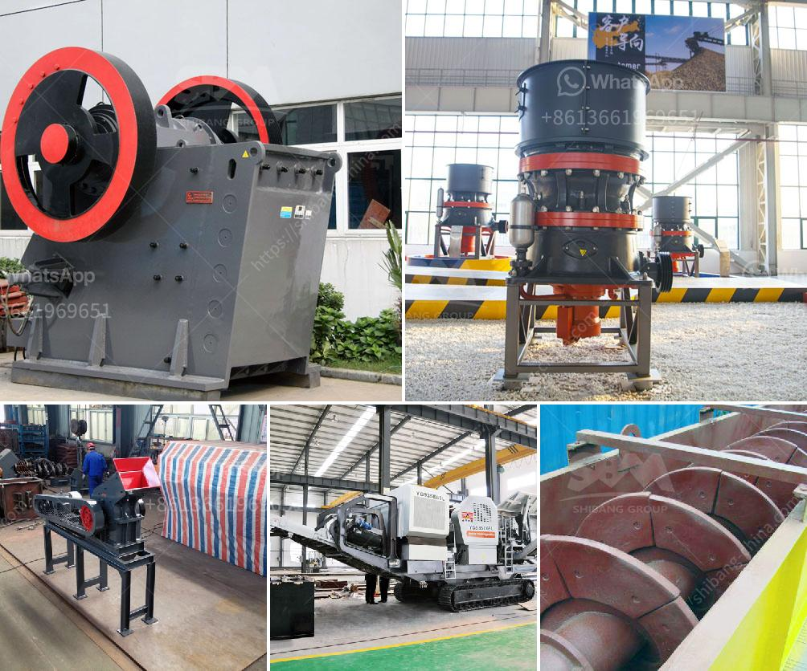

<h3>what is the cost of stone crusher？</h3>
The cost of configuring a stone crushing production line is affected by factors such as the type of stone crusher, the required specifications of the equipment, the output of the equipment, as well as the production efficiency of the entire production line. In the process of configuring the stone crushing production line, it is necessary to formulate a reasonable production plan and determine the appropriate equipment selection.

The main factors affecting the production cost of stone crusher include the price of raw materials, production requirements, equipment suppliers, market demand, etc. These factors vary depending on the region, time, and nature of the materials used. For example, when the environmental impact is large or the raw materials are scarce, the market price will be higher, which will increase the production cost of the stone crushing plant.

The price of stone crushers differs greatly depending on the different types, specifications, and production capacity. For example, jaw crushers of Great Wall Heavy Industry Company are in different models, including PE-500x750, PE-600x900, PE-750x1060, PE-900x1200, PE-1000x1200, PE-1200x1500, etc. The finished products of different specifications can be adjusted in the range of 10-425 mesh. The output of VSI sand making machine produced by Great Wall Heavy Industry Co., Ltd. can reach 30-600 tons per hour.

Different types of stone crushers have different production capacity. Therefore, different types of stone crushers require different configurations. For example, the jaw crusher is suitable for primary crushing and cone crusher is suitable for medium crushing and fine crushing. In order to meet the production requirements, different manufacturers have different configurations. The price of the machine varies. Depending on the configuration, manufacturers need to match different production line configurations according to their own production needs, which results in different prices.

In addition, there are many factors affecting the price of stone crushers, such as competition in the market, regional differences in the cost of raw materials, and even fluctuations in international currency exchange rates. Therefore, the price of stone crushers cannot be summarized in a single value. It is significant to compare prices among different manufacturers and choose a reliable supplier.

In conclusion, the cost of stone crusher depends on the types, specifications, and performance of the equipment, as well as the amount of production required. It also depends on the production configuration and manufacturer selection. For example, when investing in a stone crushing production line, customers should choose a reliable supplier and select equipment according to their actual needs. By comparing different options, the investment cost can be effectively controlled and a reasonable return on investment can be achieved.
<h3>Contact us</h3><ul><li><strong>Whatsapp:&nbsp;<a href="https://wa.me/8613661969651">+8613661969651</a></strong></li><li><a href="https://swt.shibang-china.com/?git&amp;zhl&amp;what is the cost of stone crusher？"><strong>Online Service(chat now)</strong></a></li></ul><h3>Related</h3><ul><li><a href='7 different vibrating screens how do you choose.md'>7 different vibrating screens, how do you choose?</a></li><li><a href='What is the final product of columbite.md'>What is the final product of columbite?</a></li><li><a href='What tests are used to select a suitable gold ore processing plant.md'>What tests are used to select a suitable gold ore processing plant?</a></li><li><a href='What equipment is required for a large quarry.md'>What equipment is required for a large quarry?</a></li><li><a href='What equipment do you need for coal mining.md'>What equipment do you need for coal mining?</a></li></ul>