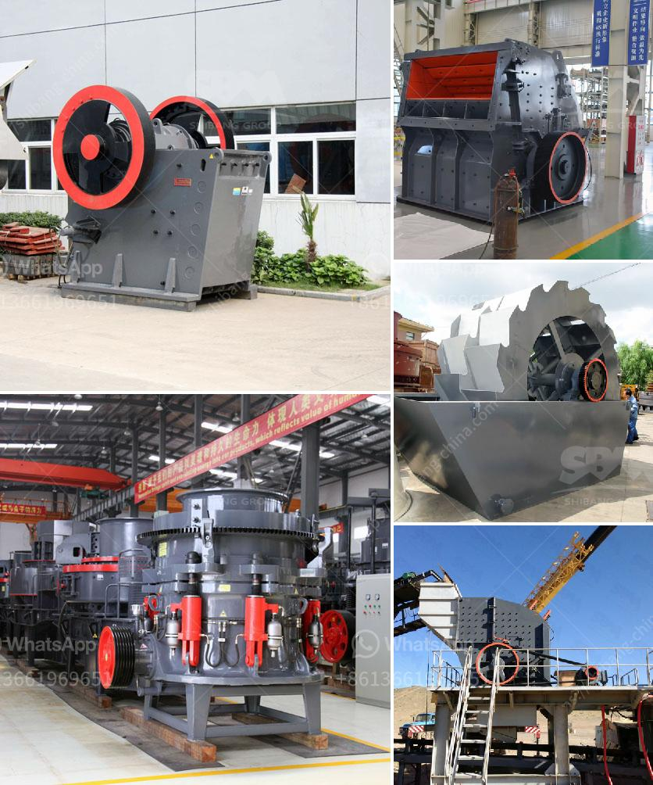

<h3>what is the difference between tube grinder and ball mill</h3>
In the vast field of grinding, there are two methods that professionals use to achieve efficient and high-quality results: tube grinders and ball mills. Both methods have their own set of advantages and disadvantages, and it's essential to understand them to make an informed decision based on your specific needs. Let's delve into the intricacies of these two processes and explore the differences that set them apart.

A tube grinder, often referred to as a tube mill, differs from a ball mill in many ways. One of the most significant differences lies in the grinding media. While the ball mill uses steel balls of various sizes, the tube mill relies on the media in the grinding chamber being agitated by rotating helical screws. The comminution process results from the continuous tumbling and cascading of the media, which generates impact and attrition forces.

Tube grinders are generally cylindrical in shape, with a rotating drum or shell that is open at both ends. The feed material is fed into one end, while the discharge takes place from the other. This design allows the tube mill to achieve a higher grinding capacity compared to the ball mill.

Moreover, the tube mill's long length-to-diameter ratio provides a larger contact surface with the grinding media, resulting in a more efficient grinding process. This increased efficiency is particularly beneficial when grinding materials that require a delicate and homogeneous product, such as cement clinker, limestone, or ores.

On the other hand, ball mills are more suitable for grinding materials with higher hardness. The steel balls used in the ball mill exert more significant force on the feed material due to their higher density and hardness. This increased force results in the comminution of tougher materials such as minerals, coals, or metallic ores. Additionally, ball mills are better suited for fine grinding applications, ensuring a higher degree of fineness and a more uniform particle distribution.

Another essential aspect where the two methods differ is their energy consumption. Tube grinders generally require lower energy inputs than ball mills due to their design and grinding principle. This makes them more energy-efficient, resulting in lower operating costs and reduced overall environmental impact. However, the specific energy consumption may vary depending on the specific application and grinding conditions.

When it comes to maintenance, tube grinders are typically easier to maintain compared to ball mills. The straightforward design and fewer moving parts make it simpler to inspect and replace worn components. In contrast, ball mills require more frequent maintenance due to the constantly rotating grinding media and the intricate mechanisms involved. However, advancements in technology have led to the development of reliable and low-maintenance ball mills.

In conclusion, while both tube grinders and ball mills serve the purpose of grinding materials, they differ in several aspects. Tube grinders, with their more efficient grinding process and energy consumption, are better suited for materials requiring a homogeneous product. On the other hand, ball mills excel at grinding tougher materials and achieving finer particle sizes. Ultimately, the choice between these two methods depends on the specific material being processed, the desired fineness, and various other factors that need to be considered on a case-by-case basis.
<h3>Contact us</h3><ul><li><strong>Whatsapp:&nbsp;<a href="https://wa.me/8613661969651">+8613661969651</a></strong></li><li><a href="https://swt.shibang-china.com/?git&amp;zhl&amp;what is the difference between tube grinder and ball mill"><strong>Online Service(chat now)</strong></a></li></ul><h3>Related</h3><ul><li><a href='What are some good ways to improve the capacity of a cement ball mill.md'>What are some good ways to improve the capacity of a cement ball mill?</a></li><li><a href='what are common raw materials for artificial sand.md'>what are common raw materials for artificial sand</a></li><li><a href='What does it cost to mill gold ore.md'>What does it cost to mill gold ore?</a></li><li><a href='What is the bearing specification for an impact crusher.md'>What is the bearing specification for an impact crusher?</a></li><li><a href='What is the price of coal crusher in Indonesia.md'>What is the price of coal crusher in Indonesia?</a></li></ul>