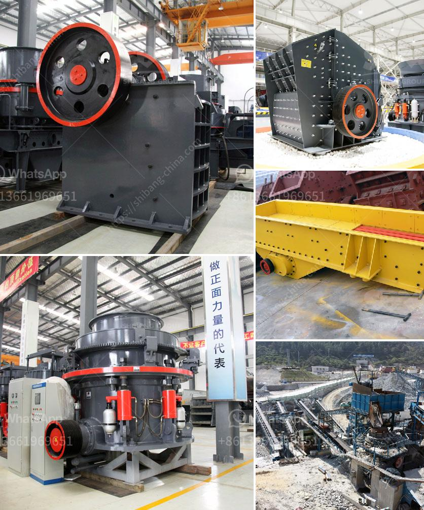

<h3>what is the process to buy stone crusher in Nigeria</h3>
The process to buy a stone crusher in Nigeria is not complicated. Stone crushers are commonly used for construction purposes. These machines are essential in certain situations, where the rocks need to be processed into smaller pieces for further usage. These machines come in different sizes and designs, making them suitable for a range of applications.

To begin the process of buying a stone crusher in Nigeria, it is important to choose the right type of machine for your needs. There are different types of stone crushers available in the market, including cone crushers, jaw crushers, impact crushers, and others. Each type has its own specifications, which determines their suitability for different tasks.

Once you have decided on the type of stone crusher you need, the next step is to find the right supplier or manufacturer. In Nigeria, there are several companies that offer stone crushing machines, making it essential to conduct thorough research to find the one that meets your requirements. Some factors to consider when choosing a supplier include reputation, experience, and the availability of spare parts and after-sales service.

After identifying the supplier, the next step is to contact them and discuss your specific needs. This will help the supplier understand your requirements and provide you with the necessary information and guidance to make an informed decision. You can request a quotation from the supplier, which should include details such as the price, delivery time, and payment terms.

Once you receive the quotation, you can compare it with other suppliers to ensure you are getting the best deal. It is also important to consider the quality of the stone crusher and its durability, as these factors will impact the machine's performance and lifespan. You can also ask for references or testimonials from previous clients of the supplier to gauge their level of customer satisfaction.

Once you have selected the supplier and agreed on the terms, the next step is to place an order. This can be done through email or by visiting the supplier's office or showroom. You will be required to make an initial payment, usually a percentage of the total price, to initiate the processing of your order.

After the order is placed, the supplier will start manufacturing or sourcing the stone crusher as per your specifications. The delivery time will depend on various factors, such as the availability of the machine and the location of the supplier. Once the machine is ready, it will be packed and shipped to your desired location.

Upon receiving the stone crusher, it is important to inspect it thoroughly to ensure it is in good working condition. If there are any issues or defects, you should immediately contact the supplier and raise your concerns. The supplier should be able to assist you in resolving any problems or provide necessary repairs or replacements.

In conclusion, buying a stone crusher in Nigeria involves several steps, including choosing the right type of machine, finding a reputable supplier, discussing your needs, comparing quotes, placing an order, and inspecting the machine upon delivery. By following this process, you can ensure that you get a reliable and efficient stone crusher that meets your requirements.
<h3>Contact us</h3><ul><li><strong>Whatsapp:&nbsp;<a href="https://wa.me/8613661969651">+8613661969651</a></strong></li><li><a href="https://swt.shibang-china.com/?git&amp;zhl&amp;what is the process to buy stone crusher in Nigeria"><strong>Online Service(chat now)</strong></a></li></ul><h3>Related</h3><ul><li><a href='What tests are used to select a suitable gold ore processing plant.md'>What tests are used to select a suitable gold ore processing plant?</a></li><li><a href='What is the definition of crushing in mining.md'>What is the definition of crushing in mining?</a></li><li><a href='What is the largest industrial crusher.md'>What is the largest industrial crusher?</a></li><li><a href='What is rotary screen cement plant .md'>What is rotary screen cement plant ?</a></li><li><a href='What are the fields of coal crushing equipment .md'>What are the fields of coal crushing equipment ?</a></li></ul>