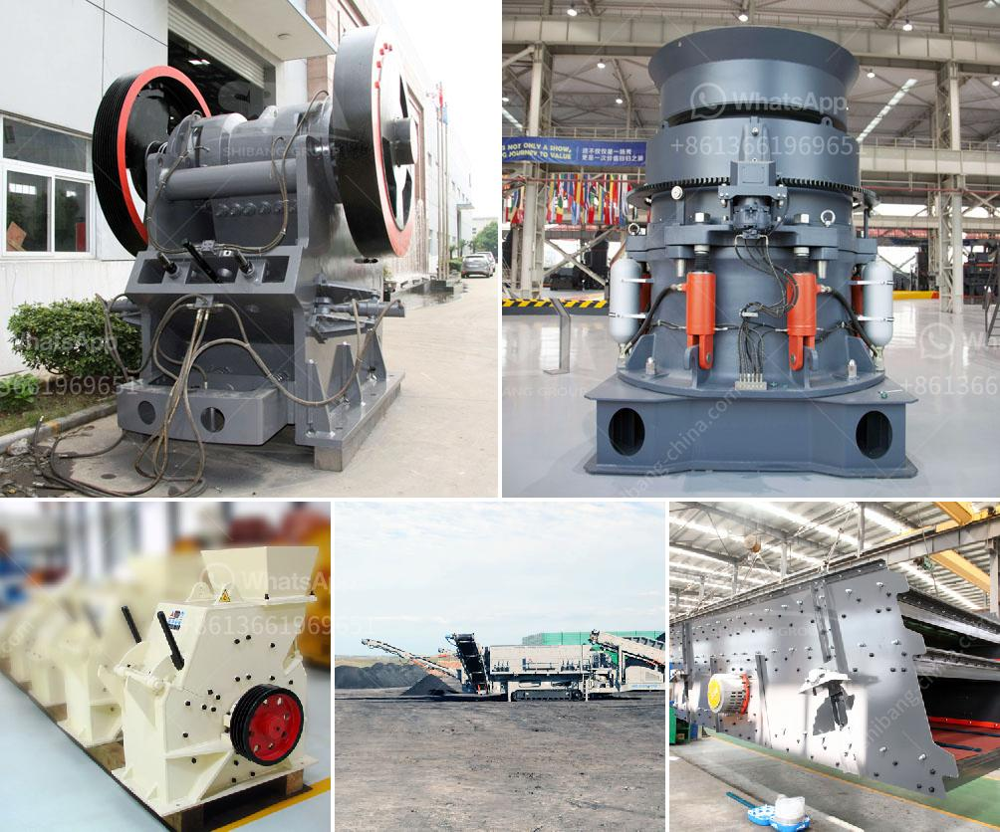

<h3>what is the quarrying process？</h3>
Quarrying is a vital industry that involves the extraction of natural resources from the earth's crust. It plays a significant role in providing materials for construction projects, infrastructural development, and the manufacturing of various products. From the towering skyscrapers to the gravel roads we traverse, quarrying processes contribute to our everyday lives in more ways than we may realize.

The quarrying process begins with careful geological exploration to identify a viable rock deposit. This initial step involves studying the area's geology, assessing its composition, and determining the quality and quantity of materials that can be extracted. There are different types of rock deposits, each with unique characteristics and suitability for different applications. This exploration phase is critical in determining the profitability and sustainability of the quarry.

Once a suitable deposit has been identified, the extraction process can commence. The actual extraction methods employed depend on factors such as the type of deposit, the depth of the resource, and environmental considerations. Generally, there are two primary methods of extracting materials from a quarry: surface quarrying and underground quarrying.

Surface quarrying, also known as open-pit mining, involves removing surface materials such as soil and vegetation to access the desired resources. This method is typically used for shallow deposits of minerals or dimensional stones such as marble and granite. Bulldozers, excavators, and haul trucks are commonly used in surface quarrying to remove overburden and extract the rocks.

On the other hand, underground quarrying is utilized when the desired resources are located at greater depths. This method involves drilling shafts and tunnels to access the deposit. Once underground, specialized equipment such as drill rigs, loaders, and conveyors are used to extract the materials. Underground quarrying is commonly employed in mining for coal, metals, and other valuable minerals.

Regardless of the extraction method, once the materials have been obtained, they undergo a series of processing steps to prepare them for their intended uses. This processing may include crushing, grinding, screening, and washing to obtain the desired particle size and cleanliness. These processes are crucial in producing consistent and high-quality products for various industries.

Quarried materials find applications in construction, manufacturing, agriculture, and many other sectors. They are used to produce aggregates for concrete and asphalt, dimension stones for building facades and flooring, crushed rocks for road construction, and limestone for cement production, to name just a few. The diversity of products derived from quarried materials underscores the importance and versatility of the quarrying process.

However, it is essential to note that quarrying does have potential environmental impacts. The removal of vegetation and soil during surface quarrying can lead to habitat destruction and soil erosion. Dust and noise generated by the extraction and processing activities may also impact air and water quality. Thus, responsible quarrying practices must be implemented to minimize these negative effects, often through environmental assessments, monitoring, and rehabilitation plans.

In conclusion, quarrying is a complex and multifaceted process that involves the extraction of valuable resources from the earth's crust. It plays a vital role in construction, manufacturing, and infrastructure development, contributing to our everyday lives in numerous ways. By understanding and implementing sustainable practices, the quarrying industry can continue to meet the growing demand for materials while minimizing its environmental footprint.
<h3>Contact us</h3><ul><li><strong>Whatsapp:&nbsp;<a href="https://wa.me/8613661969651">+8613661969651</a></strong></li><li><a href="https://swt.shibang-china.com/?git&amp;zhl&amp;what is the quarrying process？"><strong>Online Service(chat now)</strong></a></li></ul><h3>Related</h3><ul><li><a href='What equipment is necessary for crushing pumice.md'>What equipment is necessary for crushing pumice?</a></li><li><a href='What is the input and output of a crusher machine.md'>What is the input and output of a crusher machine?</a></li><li><a href='What is the standard particle size of ball mill grinding .md'>What is the standard particle size of ball mill grinding ?</a></li><li><a href='What equipment can be used to crush 6 mm aggregate into dust.md'>What equipment can be used to crush 6 mm aggregate into dust?</a></li><li><a href='What is receiving feeder in a crusher.md'>What is receiving feeder in a crusher?</a></li></ul>