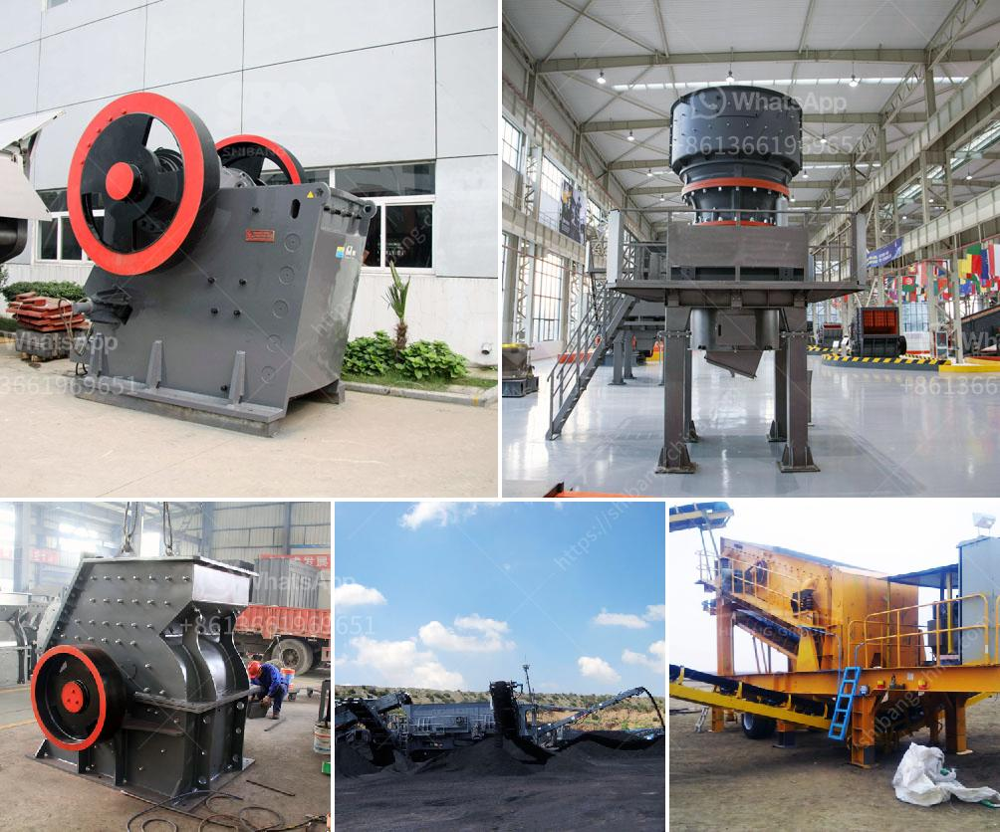

<h3>what machine is used for crushing quarry stone in philippines？</h3>
In the Philippines, granite, marble, and limestone are the major quarry stones that are widely used in building, manufacturing, and construction. These precious stones are diligently extracted from large quarries using heavy machinery, specifically designed for crushing and breaking them into smaller sizes, suitable for various applications.

The machine most commonly used for crushing quarry stone in the Philippines is typically the jaw crusher, which is an essential piece of equipment in many industries. Jaw crushers have been around for decades, and they are one of the most preferred types of crushers due to their versatility and ease of operation. They work by compressing the material between two opposing jaws, which creates a crushing motion. This process breaks down the stones into smaller pieces and produces a uniform product size.

One of the primary advantages of using a jaw crusher for crushing quarry stone is its efficiency. These machines have a high reduction ratio, meaning they can handle large quantities of material and produce a well-graded product with minimal oversize or undersize particles. This makes them ideal for applications where consistent product size is essential, such as concrete production or road construction.

Another key feature of jaw crushers is their durability. Quarry stone often contains hard and abrasive materials like granite, which can cause wear and tear on the crushing equipment. However, modern jaw crushers are designed with high-quality materials and advanced engineering techniques to withstand the demanding conditions of quarrying operations. This ensures that the machines are reliable and can handle the toughest stones without frequent breakdowns or significant maintenance requirements.

Besides jaw crushers, other machines commonly used for crushing quarry stone in the Philippines include impact crushers and cone crushers. Impact crushers use a rotating rotor with hammers or blow bars that collide with the stone, causing it to break into smaller pieces. Cone crushers, on the other hand, are similar to gyratory crushers but have a steeper crushing chamber and a smaller feed opening. They are often used for secondary or tertiary crushing applications.

Choosing the right type of crushing machine for a quarry stone operation depends on various factors, such as the desired product size, the hardness of the material, the feed rate, and the required capacity. It is crucial to consult with experts in the industry, such as equipment suppliers or engineers, to determine the most suitable machine for specific quarrying needs. They can provide valuable guidance and recommend efficient and reliable solutions tailored to the requirements.

In conclusion, the machine commonly used for crushing quarry stone in the Philippines is the jaw crusher. Its efficiency, durability, and versatility make it a preferred choice for the quarrying industry. Additionally, impact crushers and cone crushers are also utilized for crushing quarry stone, depending on the specific requirements. Ultimately, careful consideration of the material characteristics and consultation with professionals ensure the selection of the most suitable machine for quarry stone crushing operations.
<h3>Contact us</h3><ul><li><strong>Whatsapp:&nbsp;<a href="https://wa.me/8613661969651">+8613661969651</a></strong></li><li><a href="https://swt.shibang-china.com/?git&amp;zhl&amp;what machine is used for crushing quarry stone in philippines？"><strong>Online Service(chat now)</strong></a></li></ul><h3>Related</h3><ul><li><a href='What do crusher model letters represent.md'>What do crusher model letters represent?</a></li><li><a href='What are gravel ores that can be crushed by a mobile crusher.md'>What are gravel ores that can be crushed by a mobile crusher?</a></li><li><a href='what brand of iron ore crusher more advanced.md'>what brand of iron ore crusher more advanced</a></li><li><a href='What is a construction waste crusher ？.md'>What is a construction waste crusher ？</a></li><li><a href='What is a sand sieving machine.md'>What is a sand sieving machine?</a></li></ul>