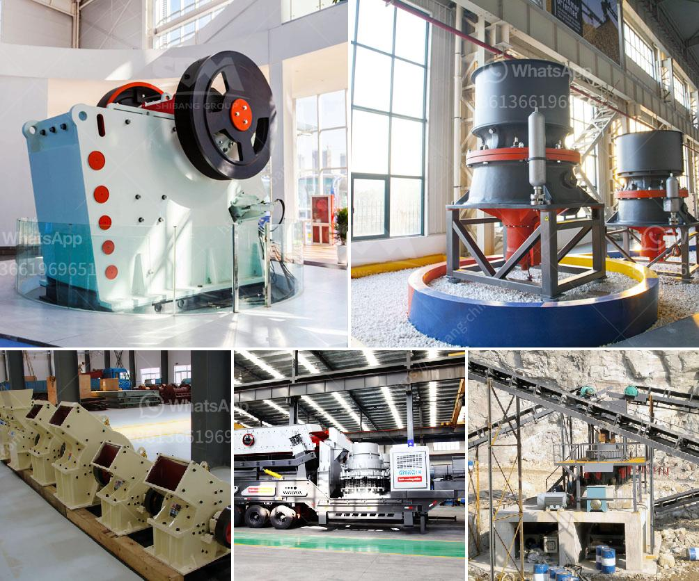

<h3>what profits from crusher machine in kenya？</h3>
Crusher machines are essential equipment in mining and construction industries. In Kenya, where the economy is dependent on agriculture, crushed stones are commonly used for construction purposes. However, crushed rocks can also be used for other purposes, such as ballast production, cement manufacturing, and landscaping.

One of the main profits from crusher machines in Kenya is the reduction of costs involved in construction materials. By crushing stones into smaller sizes, construction companies can save on transportation costs, as smaller stones are easier to transport. Additionally, crushing rocks on-site saves time and money that would have been spent on having stones delivered from quarries.

Crusher machines also play a crucial role in improving the quality of construction materials. By crushing stones to specific sizes, the resulting product can have consistent shape, making it easier to work with during construction. This ensures that the final structure is strong and durable, meeting quality standards and reducing the risk of premature deterioration.

Furthermore, crusher machines promote resource recycling and environmental sustainability. In Kenya, where the government has implemented strict regulations for sustainable development, crusher machines can help recycle waste materials from construction sites. For instance, concrete waste can be crushed and reused as aggregates in new construction projects.

Another profit from crusher machines in Kenya is job creation. The operation of crusher machines requires skilled and semi-skilled labor, contributing to the employment rate in the country. Additionally, the demand for crushed stones and aggregates creates business opportunities for small-scale entrepreneurs, who can engage in stone crushing and supply to larger construction companies.

Moreover, crusher machines contribute to the growth of the local economy. The production and supply of crushed stones and aggregates require raw materials, such as stones, sand, and cement, which are often sourced locally. This stimulates local mining and quarrying activities, creating a market for local suppliers and generating income for local communities.

In recent years, the government of Kenya has placed emphasis on infrastructure development, including roads, buildings, and bridges. The demand for construction materials, particularly crushed stones, has witnessed rapid growth. As a result, investing in crusher machines can be highly profitable for entrepreneurs and investors in Kenya.

However, it's important to note that the profitability of crusher machines depends on various factors, such as market demand, operational costs, and competition. It's essential to conduct a thorough market analysis and feasibility study before venturing into the crusher machine business. Additionally, proper maintenance and regular servicing of the machines are crucial to ensure their longevity and efficient operation.

In conclusion, crusher machines in Kenya offer numerous profits for the construction industry. They reduce construction costs, improve the quality of materials, promote resource recycling, create jobs, and contribute to local economic growth. However, entrepreneurs and investors should carefully assess the market dynamics and operational costs before investing in crusher machines. By doing so, they can tap into the lucrative opportunities provided by the construction industry in Kenya.
<h3>Contact us</h3><ul><li><strong>Whatsapp:&nbsp;<a href="https://wa.me/8613661969651">+8613661969651</a></strong></li><li><a href="https://swt.shibang-china.com/?git&amp;zhl&amp;what profits from crusher machine in kenya？"><strong>Online Service(chat now)</strong></a></li></ul><h3>Related</h3><ul><li><a href='What is the mining process of barite？.md'>What is the mining process of barite？</a></li><li><a href='What is the process of mining marble.md'>What is the process of mining marble?</a></li><li><a href='What kind of quartz can be used in the paint industry and how to get it.md'>What kind of quartz can be used in the paint industry and how to get it?</a></li><li><a href='What is a tertiary crusher.md'>What is a tertiary crusher?</a></li><li><a href='What machines are used in a crushing plant？.md'>What machines are used in a crushing plant？</a></li></ul>