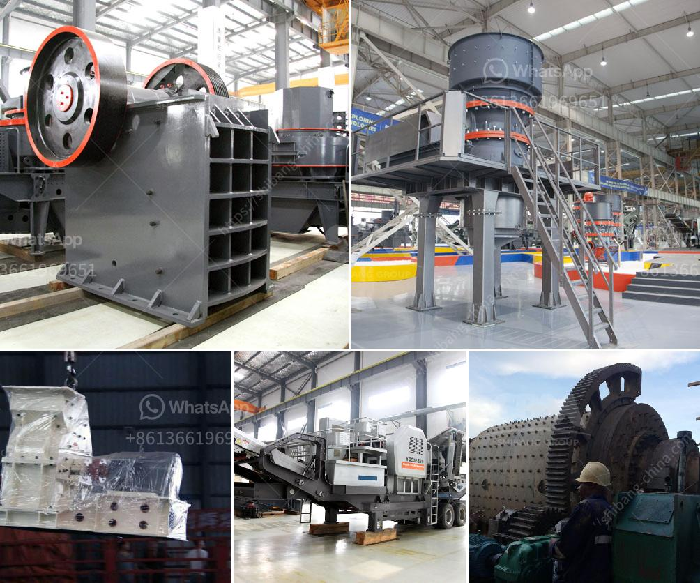

<h3>what size material can be made with an impact crusher？</h3>
An impact crusher is a versatile machine that can be used to break various types of material into smaller pieces. Indeed, the ability to reduce the size of material is one of the key characteristics of an impact crusher. However, the specific size of material that can be produced by this machinery primarily depends on the type of material being processed and the settings of the machine.

Impact crushers are commonly used in the mining and construction industry to reduce the size of minerals and materials such as rock, concrete, and asphalt. They work by delivering a high-speed impact to the material, causing it to break into smaller pieces. The size range that can be achieved with an impact crusher varies depending on the application and the desired end product.

In general, impacting machines can produce materials in a wide range of sizes, from coarse to fine. Larger impact crushers can handle larger pieces of material and produce coarser products, while smaller crushers yield finer products. Additionally, the type of material being processed also plays a crucial role in determining the size range that can be achieved.

For example, when dealing with rock, an impact crusher can break it into various sizes, from large boulders to smaller stones or gravel. The size of the final product will depend on factors such as the type of rock, the hardness of the material, and the settings of the machine. In some cases, impact crushers can even produce a combination of coarser and finer materials, providing versatility in applications where different sizes are required.

Similarly, impact crushers can be used to process concrete and asphalt, which can also be broken down into different sizes. For instance, by adjusting the machine's settings, it is possible to produce concrete aggregates of varying dimensions. This flexibility makes impact crushers a valuable tool in the construction industry, where concrete and asphalt are commonly recycled for reuse.

The size range that can be achieved with an impact crusher is usually adjustable, allowing operators to control the final outcome based on their requirements. This adjustability is often achieved by changing the machine's settings, such as the rotor speed, the clearance between the impact plates, and the feed size. By modifying these parameters, the operator can vary the size distribution of the final product.

In conclusion, impact crushers have the ability to produce a wide range of sizes, depending on the type of material being processed and the settings of the machine. Whether it's rock, concrete, or asphalt, these machines can break them into smaller pieces, providing versatility and adjustability in the final product size. Impact crushers are a valuable tool in various industries, providing a cost-effective and efficient way to reduce the size of materials for further processing.
<h3>Contact us</h3><ul><li><strong>Whatsapp:&nbsp;<a href="https://wa.me/8613661969651">+8613661969651</a></strong></li><li><a href="https://swt.shibang-china.com/?git&amp;zhl&amp;what size material can be made with an impact crusher？"><strong>Online Service(chat now)</strong></a></li></ul><h3>Related</h3><ul><li><a href='What is the difference between mining and crushing.md'>What is the difference between mining and crushing?</a></li><li><a href='What is the difference between an impact crusher and a cone crusher.md'>What is the difference between an impact crusher and a cone crusher?</a></li><li><a href='What are the different parts of a crusher in a power plant.md'>What are the different parts of a crusher in a power plant?</a></li><li><a href='What are the specifications of the crusher for crushing concrete.md'>What are the specifications of the crusher for crushing concrete?</a></li><li><a href='What is Crushing and Screening .md'>What is Crushing and Screening ?</a></li></ul>